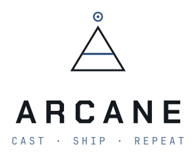
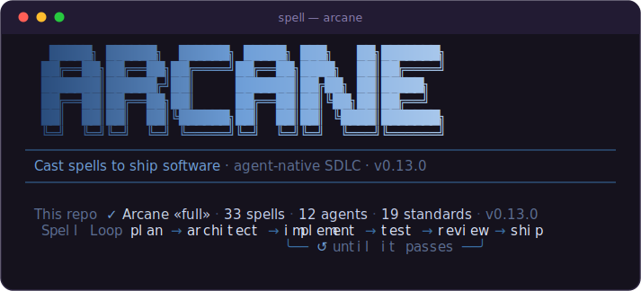
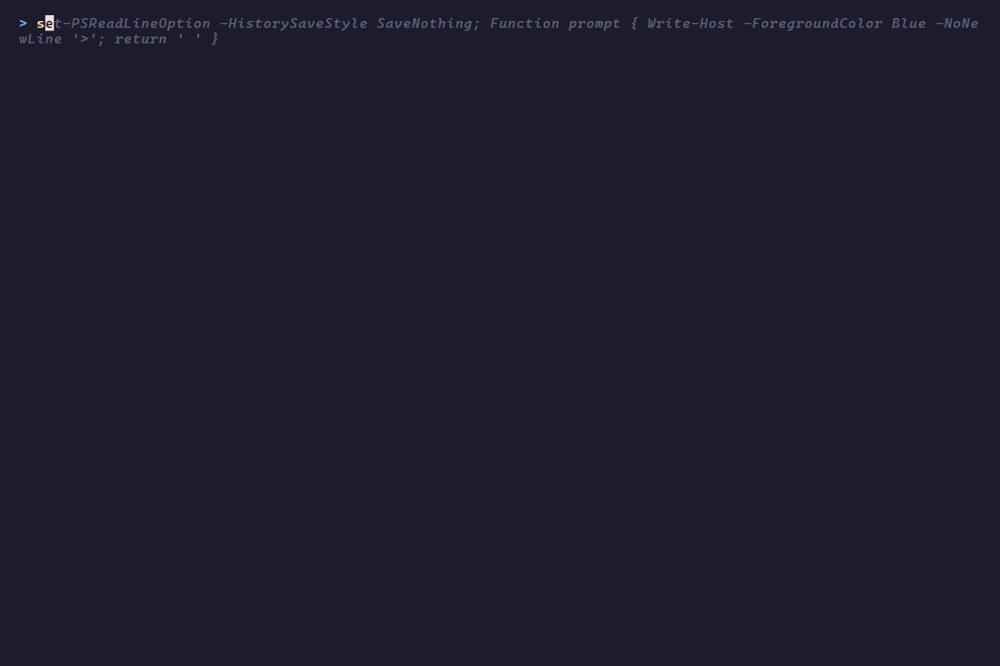
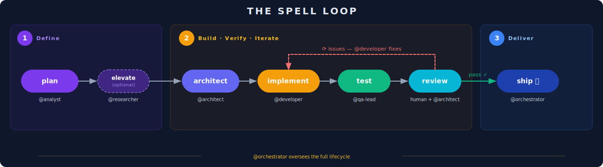

<div align="center">

<h1 align="center">
<picture>
  <source media="(prefers-color-scheme: dark)" srcset="./assets/brand/arcane-lockup.svg">
  
</picture>
</h1>

**Cast spells to ship software** — the methodology layer for AI-assisted development.

AI agents can write your code; Arcane gives them the discipline to *plan it, govern it, test it, review it, and **ship** it.*

[](https://www.npmjs.com/package/arcane-cli)
[](https://www.npmjs.com/package/arcane-cli)
[](https://github.com/codemagicianhq/arcane/actions/workflows/ci.yml)
[](https://nodejs.org)
[](https://www.typescriptlang.org)
[](./LICENSE)
[](./CONTRIBUTING.md)
[](https://github.com/codemagicianhq/arcane/stargazers)

```bash
npm install -g arcane-cli   #  then:  spell init
```

</div>

---

<div align="center">

**🔁 opinionated lifecycle** &nbsp;·&nbsp; **📜 33 spells** &nbsp;·&nbsp; **🤖 12 agents** &nbsp;·&nbsp; **⚖️ 19 governance standards** &nbsp;·&nbsp; **📝 markdown-native** &nbsp;·&nbsp; **🔌 any AI client / tracker**

</div>

---

<div align="center">



</div>

---

### See it in action

<details>
<summary><strong>⚡ Get started</strong> — one command, full methodology installed</summary>

<br>

<div align="center">

</div>

</details>

<details>
<summary><strong>🃏 Arcanos agents</strong> — assign the built-in persona roster</summary>

<br>

<div align="center">

</div>

</details>

<details>
<summary><strong>🎭 Custom agent names</strong> — name your team after any universe you own</summary>

<br>

<div align="center">

</div>

</details>

---

## The problem

AI coding agents are great at *generating code*. They're terrible at *shipping software*.

Ask one to "build a feature" and you get a pile of plausible code with no plan, no tests you trust, no review, no governance, and no repeatable path from idea to a merged, deployed change. The gap isn't code generation — it's **methodology**.

**Arcane is that missing layer.** It's a structured, opinionated lifecycle — the **Spell Loop** — plus the governance, agent roles, and templates that make AI-driven development reproducible instead of chaotic. You stay in the driver's seat and cast `spell`s; the framework keeps the work on rails.

---

## The Spell Loop

One opinionated lifecycle. Each phase is a spell you cast — and the build→test→review core loops until the work actually passes.

<div align="center">

</div>

```
/spell-plan → /spell-architect → [ /spell-implement → /spell-test → /spell-review ]* → /spell-ship
```

Plus session and operational spells — `/spell-open-session`, `/spell-close-session`, `/spell-commit-work`, `/spell-bug`, and more. Workflow spells are cast from your AI client as prompts; the `spell` CLI manages installation and the agent roster.

---

## What's in the box

Arcane isn't a prompt snippet — it's a full framework. Everything installs into your repo as plain, reviewable markdown.

| Layer | What you get |
| --- | --- |
| 📜 **Spells** | **33** prompt-driven workflows spanning the entire lifecycle — planning, architecture, implementation, testing, review, shipping, session management, and ops. |
| ⚖️ **Governance** | **19** battle-tested standards as drop-in templates: git conventions, testing standards, CI/CD, threat model, ADR format, naming, security hardening, and more. |
| 🤖 **Agents** | **12** ready-made agent personas with roles, clusters, and a gamified autonomy model — assign work and power levels per repo. |
| 🛠️ **CLI** | `spell init / add / update / status / uninstall` — install by profile or à la carte, and keep everything in sync as new versions ship. |

<details>
<summary><b>📜 The full spell catalogue (33)</b></summary>

**Core Spell Loop** — `plan` · `enchant` · `scope` · `architect` · `implement` · `test` · `review` · `ship`
**Session** — `open-session` · `close-session` · `status`
**Operational & Git** — `commit-work` · `todo` · `check-drift` · `bug` · `create-pull-request` · `address-review` · `bump`
**Specialized** — `full-cycle` · `review-batch` · `security-review` · `dotnet-expert` · `product-review` · `suggest-feature`
**Knowledge & Docs** — `document` · `explain-concept` · `feedback` · `save-idea`
**Business & Admin** — `bootstrap-business` · `brainstorm` · `generate-bot-icons` · `present-arcane` · `arcane-version`

</details>

<details>
<summary><b>⚖️ The governance standards (19)</b></summary>

`universal-agent-rules` · `development-methodology` · `git-conventions` · `testing-standards` · `cicd-standards` · `decision-documentation-standard` · `naming-conventions` · `agent-policies` · `agent-approved-paths` · `agent-work-queue-model` · `threat-model` · `hardening-checklist` · `authentication-strategy` · `product-excellence-standards` · `rca-process-standard` · `poc-management-pattern` · `spell-authoring-standards` · `new-business-setup` · `portable-bootstrap`

</details>

---

## Meet the agents

Twelve legendary agents ship with Arcane — **the Arcanos**. Each is a **role** with a **code name**; within Arcane the two are aliases: summon `Merlin` or summon `the architect` and you get the same agent. Every namesake is public domain — golden-age stage magicians, myth, and classic literature. Run `spell agents init` and choose how they're named — the **Arcanos** roster below, plain **generic** role labels, **random** names, or your own **custom** universe.

<div align="center">
<table>
<tr>
<td align="center" width="25%"><br><b>Kellar</b><br><sub>the Maestro</sub><br><sub>Product Operations Manager</sub></td>
<td align="center" width="25%"><br><b>Merlin</b><br><sub>the Archmage</sub><br><sub>CTO · Architecture Lead</sub></td>
<td align="center" width="25%"><br><b>Alexander</b><br><sub>the Man Who Knows</sub><br><sub>Research &amp; Backlog Analyst</sub></td>
<td align="center" width="25%"><br><b>Custodio</b><br><sub>the Warden</sub><br><sub>Security Operations</sub></td>
</tr>
<tr>
<td align="center"><br><b>Lince</b><br><sub>the Unmasker</sub><br><sub>Quality &amp; Test Gates</sub></td>
<td align="center"><br><b>Lafayette</b><br><sub>the Conjuror</sub><br><sub>Full-Stack Developer</sub></td>
<td align="center"><br><b>Adelaide</b><br><sub>the Illusionist</sub><br><sub>Frontend Developer</sub></td>
<td align="center"><br><b>Mercurio</b><br><sub>the Swift</sub><br><sub>Mobile Developer</sub></td>
</tr>
<tr>
<td align="center"><br><b>Prospero</b><br><sub>the Stormcaller</sub><br><sub>CI/CD &amp; Infrastructure</sub></td>
<td align="center"><br><b>Circe</b><br><sub>the Charmweaver</sub><br><sub>Marketing Strategist</sub></td>
<td align="center"><br><b>Bess</b><br><sub>the Herald</sub><br><sub>Operations Communications</sub></td>
<td align="center"><br><b>Iris</b><br><sub>the Emissary</sub><br><sub>External Collaboration</sub></td>
</tr>
</table>
</div>

Use the roster as-is, rename them to your own universe, or define new roles entirely — it's just a starting point. <sub>Agent portraits © Code Magician LLC.</sub>

---

## Quick start

```bash
# Install the CLI (binary is `spell`; `arcane` works too)
npm install -g arcane-cli

# Bootstrap the current repo with a governance profile
spell init

# Optional: set up the agent roster (Arcanos, generic, random, or custom names)
spell agents init

# Then cast workflow spells from your AI client, per the Spell Loop:
#   /spell-plan → /spell-architect → /spell-implement → /spell-test → /spell-review → /spell-ship

# Keep your installed governance current
spell status     # what's installed + available updates
spell update     # pull the latest
```

> **`spell` or `arcane`?** Both commands invoke the same CLI. `spell` ties to the Spell Loop; `arcane` is there for when you reach for the brand name. Use whichever you like.

Requires **Node.js 18+**.

### Profiles

Install everything, or just the slice you want:

| Profile | Contents |
| --- | --- |
| `lite` | Spell library + core git & testing conventions — fast start |
| `methodology` | Spells + the full methodology (no security/infra docs) |
| `governance-only` | All standards docs — no spells or agents |
| `full` | Everything — spells, governance, templates, agent definitions |

```bash
spell init --profile full
spell add agent-policies   # or install any component à la carte
```

---

## Philosophy

- **Opinionated about *how*, pluggable about *which*.** Arcane is strict about the lifecycle, governance, and commit discipline — and adapter-friendly about your tools (any AI client, any tracker, GitHub or Azure DevOps).
- **Markdown is the source of truth.** Everything is plain, reviewable, version-controlled text. No lock-in, no opaque state.
- **Reproducible by design.** Spinning up a new project should mean running `spell init`, not redoing months of process work.

---

## Built in public

Arcane is built *with Arcane*. From this repo's first commit forward, development happens in the open — planned, implemented, reviewed, and shipped using its own spells, with each session logged. Want to see how the methodology actually works? Watch the commit history.

---

## Contributing

PRs welcome. See **[CONTRIBUTING.md](./CONTRIBUTING.md)** for dev setup and conventions, and **[SECURITY.md](./SECURITY.md)** to report a vulnerability. By contributing you agree your contributions are licensed under MIT.

```bash
npm ci             # install dependencies
npm test           # run the test suite
npm run build      # produces dist/index.js + dist/assets/
npm run lint       # lint
npm run typecheck  # type-check
```

**Claude Code preview config:** [.claude/launch.json](./.claude/launch.json) registers dev-server launch configs (`arcane-website`, `arcane-ui`) for Claude Code's in-editor preview tooling. It assumes both repos are cloned as sibling directories next to this one (`../arcane-website`, `../arcane-ui`).

---

## License

**MIT** — see [LICENSE](./LICENSE). Copyright © 2026 Code Magician LLC.

> The *Arcane* name, logo, and agent art are brand assets of Code Magician LLC; the source code is MIT-licensed.

<div align="center">
<sub>Built by <a href="https://github.com/codemagicianhq">Code Magician</a> · <code>spell</code> your way to shipped.</sub>
</div>
