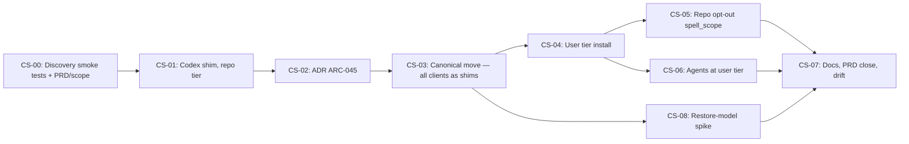

# Codex Support — A Client-Neutral Spell Source and a User-Level Install Tier

Related: [[development-methodology]] (the Spell Loop and story-sizing rules this plan's epics
follow), [[naming-conventions]] (the "Naming Test" governing CS-04's CLI-surface decision).

This is the epic-split execution plan for [features/codex-support/PRD.md](../../../features/codex-support/PRD.md),
produced via `spell-scope` and delivered in this repository's own established program shape (the
one Become Current, Lessons Hardening, and Show Report each converged on) rather than a bare
`execution-plan.md` — the analytical content `spell-scope.md` specifies (classification,
dependency graph, ADR candidates, security flags, agent assignment) is folded into the Coverage
Map and sections below.

**Classification: Program-scale** (spell-scope §2) — 8 epics spanning the build-time compiler, the
registry, three CLI commands, `spell doctor`, governance docs, one ADR, and one research spike;
roughly 35–45 estimated stories in total, well past the 30-story program-scale threshold and
touching multiple subsystems. Split into phases with milestone gates (below), not a single
Spell Loop cycle.

Three problems drive this program, each verified against the current tree (full detail in the
PRD): **(1)** Codex cannot discover or invoke any Arcane spell — zero `SKILL.md` files exist.
**(2)** Opening multiple Arcane-managed repos in one VS Code workspace duplicates every spell and
agent per folder (undocumented anywhere before this program). **(3)** The distributed spell source
is Copilot-shaped by historical accident; the operator has directed that every client become an
equally thin generated shim over one client-neutral canonical source.

See [`docs/research/skill-discovery-smoke-tests.md`](../../research/skill-discovery-smoke-tests.md)
(CS-00) for the empirical findings this plan's sequencing decisions rest on, and
[`docs/plans/become-current/OPERATOR-QUEUE.md` Q-010](../become-current/OPERATOR-QUEUE.md#q-010--decide-whether-to-pursue-a-package-referenced-distribution-model)
for the distribution-model question CS-08 unparks.

## Definition of Done

1. Every PRD acceptance criterion (AC1–AC9) is met, evidenced, and cross-referenced from the epic
   that shipped it.
2. `npm run check:self-host-parity`, `check:spell-catalog`, and `check:version-bump` pass on `main`
   after every epic that touches `src/assets/` or `src/modules/registry.ts`.
3. Codex (CLI and/or VS Code extension), Claude Code, and VS Code Copilot each discover and can
   invoke a representative spell — verified by direct client observation (EV-01), not filesystem
   inspection alone, recorded in the CS-00 research doc and re-confirmed after CS-03's canonical
   move.
4. A two-repository VS Code workspace, both opted into the user tier, shows exactly one set of
   `/spell-*` entries and one set of the 12 Arcanos agent modes (AC5).
5. [ARC-045](../../../DECISIONS.md) is `Accepted` before CS-03 starts; the canonical-source move
   ships under an explicit, operator-confirmed version number.
6. `docs/research/restore-based-delivery.md` states an explicit go/no-go on the restore-based
   distribution model (AC9) — a "go" is scoped as a new program, not folded in here.
7. `spell-check-drift` reports **GO** with zero Critical/High after the last epic; `TODO.md` has no
   unchecked item this program added without a named epic; `CHANGELOG.md` is current through the
   version this program ships.

## Dependency Graph

- **Critical path:** CS-00 → CS-01 → CS-02 → CS-03 → CS-04 → CS-05/CS-06 → CS-07.
- **Parallelizable:** CS-05 and CS-06 touch disjoint files (`init.ts`/`doctor.ts` vs.
  `agent-generator.ts`/`agents.ts`) and could run as two worktree epics — **not recommended by
  default** per `spell-full-cycle`'s own R4 footprint rule and this program's Standing Constraints
  below (both land in the same `0.4x` release window and both touch `spell init`'s option surface);
  run sequentially in one workspace unless a footprint re-check at CS-04's close shows them
  genuinely disjoint. CS-08 (research only, no code) can run any time after CS-03 lands, including
  concurrently with CS-04–06, since it produces no `src/assets/` or registry changes.
- **Milestone gates** (human-required, cannot be crossed by the standing delegation): merging
  CS-00 (activates the grant); accepting ARC-045 before CS-03; confirming the exact version number
  before CS-03 ships.

## Architecture Decisions Required

#### ADR Candidate: One Spell Source, Thin Client Shims, and a User-Level Tier (→ ARC-045)

- **Trigger:** R2/R3 require amending ARC-033 decision 1 ("no spell file is renamed or moved") and
  extending ARC-039's `render*()` model to a third client target plus a new install location ARC-019
  never contemplated.
- **Options:** (a) keep three independently-authored client copies [rejected — the drift problem
  this program exists to remove]; (b) canonical source stays at `.github/prompts/`, Codex/skills
  become a fourth copy [rejected — perpetuates the Copilot-shaped-by-accident problem, PRD problem
  3]; (c) canonical source moves to `.arcane/spells/`, all three clients (plus the user tier) are
  generated shims [recommended].
- **Recommendation:** (c), drafted in CS-02, operator-accepted before CS-03 begins.
- **Blocking:** CS-03 onward.

#### ADR Candidate: Restore-Based (`node_modules`-style) Distribution Model (→ ARC-046, conditional)

- **Trigger:** R6 — the operator's own question during planning about gitignoring generated client
  files and restoring them from a declared Arcane dependency, unparking
  [Q-010](../become-current/OPERATOR-QUEUE.md#q-010--decide-whether-to-pursue-a-package-referenced-distribution-model).
- **Options:** (a) no change, keep everything committed [status quo]; (b) restore shims only [the
  canonical move already shrinks shims to near-zero, weakening the case]; (c) restore the canonical
  folder itself, governance stays committed [the only option that changes clutter meaningfully].
- **Recommendation:** none pre-judged — CS-08 is a research spike specifically because the answer
  depends on the customization-overlay design, which does not exist yet.
- **Blocking:** nothing in this program. A "go" verdict opens a new, separate program.

## Security Flags

- **New attack surface: none identified.** No new endpoints, no new auth flow, no PII/payment data.
- **New write locations:** the user tier writes under the operating user's own home directory only
  (`~/.arcane/`, fan-out to `~/.claude/skills/`, `~/.agents/skills/`), following the existing
  OpenClaw precedent (`src/modules/agent-generator.ts ("openclawRoot = roster.openclaw.workspace_root.replace")`) — not a new pattern, an extension
  of one already shipped.
- **Trust boundary:** unchanged — `spell init --user` runs as the same local operator invoking
  `spell init` today; no new external integration, no new credential handling.
- **OWASP relevance:** none of the top 10 categories apply to a local file-generation CLI with no
  network calls added. Not blocking.

## Agent Assignment

This repository has no installed agent roster (`.arcane/agents.yaml` absent, confirmed) — the same
state Lessons Hardening and Show Report ran under. Work is assigned by role label, resolved to a
concrete persona only if a roster is installed before this program starts:

| Epic | Primary role | Notes |
|---|---|---|
| CS-00 | Research | Discovery smoke tests, PRD/scope completion |
| CS-01 | Backend/Full-stack | Compiler + registry + parity script |
| CS-02 | Architecture | ADR drafting only, no code |
| CS-03 | Backend/Full-stack | Largest epic — compiler, registry, migration logic |
| CS-04 | Backend/Full-stack | New CLI surface + user-tier module |
| CS-05 | Backend/Full-stack | Manifest field + doctor check |
| CS-06 | Backend/Full-stack | Agent fan-out extension |
| CS-07 | Docs | No code |
| CS-08 | Research | No code, ADR draft only |

No epic needs QA/DevOps/Mobile/Marketing roles. No multi-role epic.

## Authority & Delegation

This repository has no installed agent roster, and `agent-policies.md` fails closed: missing
authority ⇒ human execution required for commit and merge. As with the three prior programs, the
operator resolves that explicitly for this one:

> **Standing delegation, recorded explicitly in [`.arcane/delegations.json`](../../../.arcane/delegations.json)
> (id `codex-support-plan`), listable via `spell doctor`, revocable by editing or removing that
> entry:** sessions executing epics of this plan may — without per-action approval — create session
> branches, commit, push, open PRs, and merge their own PRs into `main` via the sanctioned
> strategies (merge/rebase, never squash), for work scoped to an epic defined in this plan. **The
> grant activates only once the operator merges CS-00's own PR** — until then, work on this plan is
> interactive/operator-merged, the same way Phase 0 was on every prior program.

**Explicitly outside the grant** (always queue, never perform) —
`.arcane/delegations.json`'s `excludedActions` for this entry is the source of truth; summarized
here for readability:

- Any GitHub/ADO **platform-settings mutation**: rulesets, required checks, `allow_auto_merge`,
  repo settings, secrets, webhooks.
- Deleting or force-resetting any branch that holds content not on `main` (content-verified via
  `git cherry` + diff, not ancestry).
- Manual `npm publish` or `workflow_dispatch` of publish/release workflows (the automatic
  version-bump → `release-drift.yml` → `publish.yml` chain is sanctioned and expected).
- **Accepting ARC-045 (or ARC-046)** — both stay `Proposed` until the operator accepts via
  `OPERATOR-QUEUE.md`.
- **Merging CS-03** (the breaking, version-bumping canonical-move epic) **without the operator
  having explicitly confirmed the target version number in `OPERATOR-QUEUE.md` first** — a merged
  bump auto-publishes to npm within minutes (`release-drift.yml` → `publish.yml`), so this is a
  one-way door the standing grant does not cover on its own.
- Marking anything in `OPERATOR-QUEUE.md` as approved/done — operator-only.
- Anything in `.arcane/governance/agent-policies.md`'s prohibited list (MCP/security config, etc.).

## Standing Constraints (digest — full text in the cited sources)

Identical invariants to the three prior programs — these are repo-wide, not program-specific:

- **Serial by construction.** Any change under `src/assets/`, to `src/modules/registry.ts`, or
  `src/config/profiles.ts` requires a `package.json` version bump differing from `main`
  (`scripts/check-version-bump.ts`). Epics touching those paths run one at a time, sequentially —
  never two concurrent worktree epics in this repo (ARC-028 R4).
- **Every merged bump publishes.** `release-drift.yml` auto-creates the release on a
  `package.json` version change on `main`; `publish.yml` publishes to npm with provenance. Batch
  each epic's `src/assets/` changes into ONE PR.
- **PR-only, no squash, rebase-before-PR.** Required checks: `Lint, typecheck, test, build`, `PR
  branch is rebased on target`, `Review round clear`. Pre-PR guard: `git fetch origin && git
  rebase origin/main && git push --force-with-lease`.
- **Hooks are slow by design.** `.husky/pre-push` runs the full test suite; budget for long pushes.
- **Session lifecycle.** Every iteration: `spell-open-session` → work → `spell-close-session`.
  Session branches: `sessions/YYYY-MM-DD-<topic-slug>`.
- **Attribution trailers** on every commit per `git-conventions.md`.
- **Working protocol** (root `CLAUDE.md`): verify before asserting; checked ≠ inferred ≠ told; a
  green test suite is not itself evidence.
- **No global `testTimeout`, ever** — named budgets only (Become Current lesson E28).
- **No `docs/intake/batch-002/` or `EF-37`** — reserved for a genuine independent external
  submission (EF-18).
- **The `arcane-arc028` linked worktree is a known bystander** (stale, superseded, flagged in
  [ai-context/system-prompt-context.md](../../../ai-context/system-prompt-context.md)'s
  consumed handoff note 2026-09-09) — not this program's; leave it alone.
- **No `/loop` or `ScheduleWakeup` in this repository** — this program drives its own loop via
  `KICKOFF.md`, one epic per session, exactly like its three predecessors.

## Coverage Map

- [x] **CS-00 — Discovery smoke tests + PRD/scope completion.** Route: `direct`. Size: S. Bump: no.
  Dependencies: none. Risk: Low. Produces this plan, `KICKOFF.md`, `OPERATOR-QUEUE.md`, the
  `codex-support-plan` delegation record, the completed PRD, and
  `docs/research/skill-discovery-smoke-tests.md`. **Operator merged this one** (see Authority &
  Delegation) — [PR #220](https://github.com/codemagicianhq/arcane/pull/220), merged 2026-09-09.
  **Report:** Arcane now has a plan to work inside OpenAI Codex, and a way to stop it flooding VS
  Code with duplicate spells when several Arcane projects are open at once — the plan, not the
  feature itself yet. · category: docs
- [x] **CS-01 — Codex shim, repo tier (ships Codex).** Route: `chain` (plan already done; architect
  → implement → test → review → ship). Size: M (~5-6 stories, shipped as 4). Bump: minor
  (0.38.3 → 0.39.0). Dependencies: CS-00. Risk: Low — additive only, nothing moved.
  `renderCodexSkill()` in `spell-compiler.ts`, `runSkillParity` in `self-host-parity.ts`, registry
  third-file-per-spell (41 spells), `scanSkillsDirectory` in `org-token-lint.ts`, a
  `universal-agent-rules.md` note (not a table row — that table is about standing-instruction files,
  a category error caught before committing, not the spell-discovery table it was drafted as).
  60 new tests. [PR #221](https://github.com/codemagicianhq/arcane/pull/221), merged 2026-09-09,
  self-merged under the standing delegation (no operator action needed for this epic).
  **Report:** Codex can now see and run every Arcane spell — the first of three clients this
  program brings to parity. · category: feature
- [x] **CS-02 — ADR ARC-045.** Route: `adr`. Size: S. Bump: no. Dependencies: CS-01 (informs the
  ADR with what CS-01 actually shipped). Risk: Low. Drafted `Proposed` in `DECISIONS.md`
  ([PR #226](https://github.com/codemagicianhq/arcane/pull/226), merged 2026-09-09) and **Accepted**
  by the operator the same day via `OPERATOR-QUEUE.md` Q-002. CS-03 is unblocked, pending only the
  CHANGELOG catch-up precondition and Q-003's version-number confirmation (recorded: 1.0.0).
  **Report:** The architectural decision behind bringing every AI client to parity and fixing
  duplicate spells across projects is written down and accepted. · category: decision
- [x] **CS-03 — Canonical move: `.arcane/spells/` + all clients as shims.** Route: `chain`. Size: L
  (~10-12 stories; shipped as 10). Bump: **major — `1.0.0`**, operator-confirmed at
  `OPERATOR-QUEUE.md` Q-003. Dependencies: CS-02 (ARC-045 Accepted 2026-09-09). Risk: High — the one
  breaking change in this program. Precondition met: the CHANGELOG catch-up landed as
  [PR #231](https://github.com/codemagicianhq/arcane/pull/231). **Premise corrected on the record
  (Loop Protocol step 3):** the consumer-migration fixture, run against a real `0.39.0` consumer
  *before* building, showed the pre-CS-03 `spell update` does not conflict on a hand-edited prompt —
  it three-way merges the edit "successfully" into the new shim (edit dangling underneath, reported
  as `Merged your edits`), conflicts only for an in-body edit, and is silent for installs without
  recorded hashes; the same fixture exposed an ARC-038 defect (an edit survived exactly one update,
  because the merged file's hash was recorded), fixed in this epic. Design and evidence:
  `features/codex-support/architecture.md`. **Shipped in
  [PR #232](https://github.com/codemagicianhq/arcane/pull/232) — merged by the operator 2026-09-09
  (rebase, `a68c974`; never self-merged, per Authority & Delegation); `release-drift.yml` cut
  `v1.0.0` and [`publish.yml` succeeded](https://github.com/codemagicianhq/arcane/actions/runs/34443698300),
  `npm view arcane-cli version` → `1.0.0` (published 2026-09-10T06:06Z, tarball verified to carry
  `dist/assets/.arcane/spells/`):** canonical move (41 files, history preserved) +
  `renderCopilotPromptShim` / retargeted Claude and Codex renderers + `runShimParity` + registry
  four-per-spell + every gate retargeted + 28 test files repointed; `spell update` keeps customized
  shims, restores missing tracked files at the same version, and records the vendor hash after a
  merge; governance/README/CHANGELOG `1.0.0`; independent review 0 HIGH / 3 MEDIUM / 6 LOW, all
  addressed before merge; EV-01 re-confirmed for Claude Code and Codex, Copilot recorded as an
  operator check (`OPERATOR-QUEUE.md` Q-004; `docs/research/skill-discovery-smoke-tests.md`).
  **Report:** Every spell now has exactly one home, and Copilot, Claude Code and Codex all read from
  it through tiny generated pointers — spells can no longer drift between clients, and updating never
  silently overwrites a spell you customized. · category: feature
- [x] **CS-04 — User tier install.** Route: `chain`. Size: M (~6-7 stories; shipped as 7). Bump:
  minor (`1.0.0` → `1.1.0`). Dependencies: CS-03. Risk: Medium — new CLI surface (`--user`), new
  module (`src/modules/user-tier.ts`), `HOME`/`USERPROFILE` test stubbing. **Premise corrected on the
  record (Loop Protocol step 3), against vendor documentation fetched before building:** VS Code has
  deprecated `chat.promptFilesLocations` and its siblings ("will be removed in a future release") and
  discovers `~/.agents/skills` by default, so the planned printed settings snippet became a printed
  note that no setting is needed; and because Copilot also scans `~/.claude/skills`, the Claude Code
  file went to `~/.claude/commands/<id>.md` rather than `~/.claude/skills/<id>/SKILL.md`, so Copilot
  does not list every spell twice (both recorded as ARC-045 implementation variances in
  `DECISIONS.md`). Naming Test call (ARC-045 open question 1): `--user` on the four verbs, not a
  `spell user` noun. Design and evidence: `features/codex-support/architecture.md` ("CS-04"). **Shipped
  in [PR #234](https://github.com/codemagicianhq/arcane/pull/234), self-merged under the standing
  delegation 2026-09-10 (rebase, `dac7a8f`; no operator action needed for this epic);
  `release-drift.yml` cut `v1.1.0` (published 2026-09-10T15:46Z) and
  [`publish.yml` succeeded](https://github.com/codemagicianhq/arcane/actions/runs/34497846257) —
  `npm view arcane-cli version` → `1.1.0` (15:47Z), tarball unpacked and checked (`dist/index.js` carries
  the user tier, `init --help` lists `--user`):** `spell init|update|status|uninstall --user`; the `~/.arcane` store (canonical spells only, through a scope-aware view of the registry —
  copier, hash record, same-version restore and the ARC-038 merge reused unchanged); the fan-out to
  `~/.agents/skills` (Codex + Copilot) and `~/.claude/commands` (Claude Code) with absolute paths,
  recorded in the manifest's `fanout` map and reconciled under the hash rule (edited → kept and named;
  never-recorded → never claimed; pruned only while hash-matched); `spell doctor`'s non-blocking
  user-tier row; the `scope`/`fanout` manifest fields; a general fix to the merge path's published-file
  fetch (asset path). Codex followed a user-level skill to an absolute path from an empty directory —
  before the design and again against the real `spell init --user` output; Claude Code and Copilot at
  the user tier are the operator's Q-005. AC5's second half (one set of `/spell-*` across two
  repositories in one workspace) waits for CS-05's opt-out.
  **Report:** Install Arcane's spells once on your machine and every AI client — Codex, Copilot,
  Claude Code — finds them from any project, with nothing to configure and nothing of yours ever
  overwritten. · category: feature
- [x] **CS-05 — Repo opt-out (`spell_scope`).** Route: `chain`. Size: S-M (~4-5 stories; shipped
  as 5). Bump: minor (`1.1.1` → `1.2.0`; shipped in its own PR, not combined with CS-04's).
  Dependencies: CS-04. Risk: Medium — the migration/prune logic must never silently drop an
  operator-edited file (ARC-038 hash rule). **Premise corrected on the record (Loop Protocol step
  3):** there is no prune logic to write. Measured on a real consumer beside a stubbed-home user
  tier *before* building — 170 tracked files, 170 hash-recorded, and after one hand edit exactly
  169 matched and 1 did not — opting out turns the repository's spell files into orphans, and that
  machinery already reports every run and deletes only under `--prune` while `fileMatchesHash`
  holds. The epic's real job was to make the `spells-*` components install nothing. A second
  finding reframed the epic's motivation: with both tiers present, which copy of a spell a client
  runs is **not predictable** — `/spell-full-cycle` resolved through the user tier while
  `/spell-open-session` resolved through the project copy, minutes apart in the session that
  designed this (`docs/research/skill-discovery-smoke-tests.md`, "CS-05"), which is also the first
  live confirmation that a personal command's absolute `@` include loads the canonical body.
  Design: `features/codex-support/architecture.md` ("CS-05"). **Shipped in
  [PR #238](https://github.com/codemagicianhq/arcane/pull/238), self-merged under the standing
  delegation 2026-09-11 (rebase, `3e0b979`); `release-drift.yml` cut `v1.2.0` (published
  2026-09-11T06:18Z) and [`publish.yml` succeeded](https://github.com/codemagicianhq/arcane/actions/runs/34569378898)
  — `npm view arcane-cli version` returns `1.2.0`, and a scratch install of that version carries
  `spell_scope`:** `spell_scope` on the
  manifest (absent = `repo`, validated); `componentForSpellScope` emptying the `spells-*`
  components with a test pinning that those are exactly the components carrying a canonical or
  shim path; `init` asking only when a store exists and defaulting to **No**; `update` making the
  opt-out visible on the very next run and reversible on the run after that; a **blocking**
  `spell doctor` check; and the `Scope: repo (spells: user tier)` status line. Three defects the
  work surfaced and fixed: a same-version update short-circuited on "Already up to date." and
  never mentioned the newly unmanaged files; switching back had the mirror problem; and pruning
  left 41 empty directories behind. One data-loss path closed: an orphan still on disk now keeps
  its manifest entry and recorded hash, so `--prune` can act on it later, `spell uninstall` cannot
  leak it, and re-adoption cannot overwrite an edit in silence. EV-01: two repositories beside one
  tier went to 0 and 160 spell paths, governance untouched, `doctor` exit 0 then exit 1 with the
  store removed. PRD AC6 met; AC7 met for spells (agents stay with CS-06).
  **Report:** Open several Arcane projects at once and you now see one set of spells instead of one
  set per folder — a repository can take its spells from your machine-wide install, and anything you
  edited is named rather than removed. · category: feature
- [ ] **CS-06 — Agents at the user tier.** Route: `chain`. Size: S-M (~4 stories). Bump: minor
  (may combine with CS-04/05's bump). Dependencies: CS-04. Risk: Low. **Report:**
- [ ] **CS-07 — Docs, PRD close, drift.** Route: `direct`. Size: S. Bump: no. Dependencies: CS-05,
  CS-06, CS-08. Risk: Low. README, `portable-bootstrap.md`, `spell-authoring-standards.md`, PRD
  `status: complete`, final `spell-check-drift` GO. **Report:**
- [x] **CS-08 — Distribution-model spike (restore-based delivery).** Route: `adr` (research +
  ADR draft, no implementation). Size: M (research-heavy). Bump: no. Dependencies: CS-03 (needs the
  canonical folder to exist to spike against). Risk: Low — produces a decision, not code. Verdict
  goes to `OPERATOR-QUEUE.md`; a "go" is a new program, never folded back into this one. **Ran
  2026-09-10, after CS-04 rather than last, at the operator's direction ("cs-08 if make sense to run
  it now" — it did: research-only, no `src/assets`/registry footprint, and the user tier now exists
  to compare against).** Built the model instead of arguing it: a `lite` consumer with its four spell
  folders gitignored, a fresh clone restored in full by today's same-version `spell update` (160
  files), Codex discovering the restored, ignored skills (81 `spell-*` listed), and an edit to a
  restored spell invisible to git and gone on a second clone. **Verdict: no-go for now, mechanism
  retained** — `docs/research/restore-based-delivery.md` (eight findings) and ARC-046 drafted
  `Proposed` in `DECISIONS.md`; the symlink/junction variant Q-010 named is rejected outright
  (ARC-027's constraint, plus VS Code's deprecation of the setting BC-28's junction finding relied on).
  Operator decision: `OPERATOR-QUEUE.md` Q-006. ADR-drafting PR, operator-merged per Authority &
  Delegation: [PR #237](https://github.com/codemagicianhq/arcane/pull/237), which also carries the
  session-close record (one open PR regenerating this program's report at a time). AC9 met.
  **Report:** Arcane looked hard at making spell files vanish from your repository and reappear on
  install, built the experiment, and decided against it: the user tier already removes the
  duplication, and a file git cannot see cannot carry your edits. · category: decision

## Recommended Execution Order

1. CS-00 (this session) → operator merges → grant activates.
2. CS-01 — ships Codex. Checkpoint with `spell-commit-work` before CS-02.
3. CS-02 — ADR drafted → **milestone gate:** operator accepts ARC-045 via `OPERATOR-QUEUE.md` Q-002.
4. CHANGELOG catch-up (small, unlisted sub-step of CS-03's precondition).
5. CS-03 → **milestone gate:** operator confirms version number via `OPERATOR-QUEUE.md` Q-003 →
   ship. This is the program's highest-risk merge; verify the consumer-migration fixture personally
   before requesting the gate.
6. CS-04, then CS-05 and CS-06 (sequential per the Standing Constraints footprint note above).
7. CS-08 (may run any time after step 5; scheduled here so its findings can inform CS-07's docs).
8. CS-07 — close the program.

## Loop Protocol (one epic per session)

1. **Open:** run `spell-open-session` with focus `codex-support: <next epic id>`. Consume any
   handoff. If drift check reports HIGH → fix or queue before proceeding.
2. **Select:** the topmost unchecked epic whose dependencies are satisfied and which is not
   blocked on `OPERATOR-QUEUE.md`. Check `git worktree list` for footprint overlap
   (`arcane-arc028` is a known bystander, not this program's — leave it alone).
3. **Empirical-first:** run the epic's named empirical-first step *before* building (e.g. CS-03's
   consumer-migration fixture; CS-00's actual client checks). If it contradicts the epic's premise,
   correct the epic entry on the record and proceed against the tree, not the text.
4. **Execute** per the epic's Route (`direct` / `chain` / `adr` — same meanings as the three prior
   programs' Loop Protocols). For `chain` epics, invoke `spell-full-cycle` end to end.
5. **Cite by stable locator** — a heading anchor or a unique quoted phrase — never a bare
   `file:line`, in every durable artifact this program touches.
6. **Ship:** rebase, PR, wait for required checks, merge under the grant (ADR-drafting PRs and
   CS-03 are operator-gated regardless of route, per Authority & Delegation above). One epic = one
   PR unless the epic says otherwise.
7. **Record:** tick the epic's checkbox here with its PR (and version if bumped), fill its
   **Report:** line, close the `TODO.md`/PRD item(s) it routes from, append operator items to
   `OPERATOR-QUEUE.md`.
8. **Close:** `spell-close-session` — leave a clean, accurate handoff (session handoff durability,
   ARC-040): name the next eligible epic and whether it's gated.
9. **Halt conditions** (end the loop, leave a clean handoff): two consecutive epics halted; drift
   check NO-GO beyond autonomous repair; a required check failing on `main`; everything remaining
   is operator-blocked (an unaccepted ADR, an unconfirmed version number).

## Danger Gates & Operator Queue

[OPERATOR-QUEUE.md](OPERATOR-QUEUE.md) is the single mutable surface between loop and operator.
The loop **appends** fully-prepared entries; the operator executes/approves and marks them done.
Seeded today with: **Q-001** (merge CS-00 — activates the grant above), **Q-002** (accept/revise/
reject ARC-045), **Q-003** (confirm the version number for CS-03).

---
