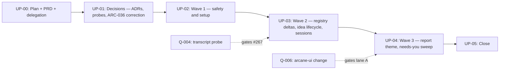

# Upstream Intake 2026-09 — Every Open Issue, Fixed in Parallel Waves

Related: [[development-methodology]] (the Spell Loop each wave runs), [[git-conventions]] (branch,
PR and merge rules), [[agent-policies]] (the multi-agent concurrency rules the lanes follow).

This is the execution plan for [features/upstream-intake-2026-09/PRD.md](../../../features/upstream-intake-2026-09/PRD.md),
produced via `spell-scope` in the program shape Become Current, Lessons Hardening, Show Report and
Codex Support used. It covers the **19 open GitHub issues** (#261–#271, #274–#275, #277–#282),
checked against GitHub on 2026-09-27 and matching `TODO.md`'s three "Upstream intake" sections one
to one.

**Classification: Program-scale** (spell-scope §2). About 45–50 estimated stories across the CLI
(`hub.ts`, `init.ts`, `update.ts`, `registry.ts`, `doctor.ts`, `report.ts`), 15+ spells, 6
governance docs, 3–4 ADRs and one cross-repository change. That is past the 30-story threshold, so
it splits into waves with milestone gates.

**What is new in this program:** parallel stories. Every earlier program here ran strictly serially
because `check-version-bump` makes `package.json` a shared sequence and ARC-028 R4 serializes
overlapping footprints. This program keeps both rules and gets parallelism *inside* a wave: one wave
is one PR and one bump, and inside it, lanes with disjoint file sets run as parallel subagents in
separate linked worktrees. See [Wave and lane map](#wave-and-lane-map) and
[Loop Protocol](#loop-protocol-one-wave-per-session).

## Definition of Done

1. Every PRD Must Have acceptance criterion is met and cross-referenced from the wave that shipped it.
2. All 19 issues are closed by a merged wave PR (`Closes #NNN`), or, for #267 only, closed as not
   reproducible with the `OPERATOR-QUEUE.md` Q-004 probe record linked.
3. Each code wave (UP-02, UP-03, UP-04) shipped as exactly one PR with one version bump, and no two
   wave PRs were open at once.
4. Every ADR this program drafts is `Accepted` before the wave implementing it merges.
5. Every wave PR quotes the orchestrator's lane-allowlist check output, and no lane touched a file
   outside its allowlist.
6. `npm run check:self-host-parity`, `check:version-bump`, `check:report` and the full test suite
   pass on `main` after every wave.
7. `spell-check-drift` reports GO with zero Critical/High after UP-05. `TODO.md`'s three intake
   sections are ticked or explicitly re-routed, and `CHANGELOG.md` is current through the last
   version this program ships.

## Priority ranking

The full table with rationale is in the PRD
([Prioritization](../../../features/upstream-intake-2026-09/PRD.md#prioritization)). In short:

1. #280 — false protection on sensitive repos
2. #262 — privacy leak path
3. #282 — harness-drivable setup
4. #269 — empty PR bodies
5. #278 — wrong default
6. #264 — number collisions
7. #279 — silent registry changes
8. #266 — needs-you convention
9. #277 — placeholder check
10. #261 — tag leak surface
11. #274 — lesson routing
12. #281 — `.gitattributes` for all profiles
13. #265 — tracker-id suffix
14. #268 — `spell-todo --prune`
15. #263 — idea-validation prompts
16. #275 — lesson harvest
17. #267 — transcript recovery
18. #270 — Mermaid rendering claim
19. #271 — Show Report theme

Ranks 1–5 all ship in the first code wave (UP-02). **Rank sets priority; dependencies and file
ownership set the wave.**

## Dependency Graph

- **Critical path:** UP-00 → UP-01 → (ADR acceptance) → UP-02 → UP-03 → UP-04 → UP-05.
- **Why waves are serial:** each code wave bumps `package.json`, and every merged bump publishes. A
  second wave PR open at the same time would collide on the version (ARC-028 R4).
- **Why lanes are parallel:** lanes inside a wave own disjoint files. Every shared sequence
  (`package.json`, `CHANGELOG.md`, `DECISIONS.md`, ARC numbers) belongs to the orchestrator, not to a lane.
- **Milestone gates (human):**
  - Merging UP-00 activates the grant.
  - Q-002 (PRD decisions) must be answered before UP-01 drafts.
  - Q-003 (ADR acceptance) must come before UP-02.
  - Every wave PR is operator-merged (PRD D-16).
  - Q-006 must land before UP-04's lane A.

## Wave and lane map

Lane assignment is by **file ownership**. Each file belongs to exactly one lane in its wave, and a
story goes to the lane that owns its files. One issue can therefore span two lanes; #280's CLI part
and its spell part are the main example. The orchestrator re-verifies these sets at wave start
against the current tree, including test files (Loop Protocol step 4). A file set that no longer
holds is moved or serialized before any lane starts.

**Orchestrator-owned in every wave:**
- `package.json`, `package-lock.json`, `CHANGELOG.md`, `DECISIONS.md`
- `.github/workflows/**`
- `features/upstream-intake-2026-09/**`, this plan directory
- any test file that asserts on files owned by two different lanes

### UP-01 — Decisions (no lanes write; research fans out)

Only one writer, because `DECISIONS.md` is a single shared-sequence file. Read-only subagents may
research and draft each ADR's text in parallel. The orchestrator writes all of them serially and
allocates their numbers once, per PRD D-04.

### UP-02 — Wave 1: safety and setup (bump: minor)

| Lane | Owns | Issues / stories | Est. stories |
|---|---|---|---|
| A — CLI questions and push enforcement | `src/modules/hub.ts`, `src/commands/init.ts`, `src/commands/update.ts`, `src/index.ts`, `src/types.ts`, `src/modules/manifest.ts`, `src/modules/push-safety.ts`, new `src/commands/block-push.ts`, `README.md`, their tests | #280 CLI (R-280a), #282 CLI (R-282), #278 (R-278), #261 field (R-261) | 7 |
| B — push and PR spells | `spell-commit-work.md`, `spell-create-pull-request.md`, `spell-ship.md`, `spell-sync-pull-request.md`, `spell-close-session.md` (push step only), `git-conventions.md`, `universal-agent-rules.md` | #269 (R-269), #280 spells and governance (R-280b) | 4 |
| C — idea privacy | `spell-manifest.md`, `spell-save-idea.md` | #262 (R-262), #261 spell (R-261) | 2 |
| D — placeholder check | `src/commands/doctor.ts`, new `src/modules/placeholders.ts`, `spell-authoring-standards.md`, template docs re-statused (`agent-approved-paths.md`, `naming-conventions.md`, others found), `spell-check-drift.md` | #277 (R-277), plus #280's `doctor` remedy text (file-owned here) | 3 |

Spell and governance paths are under `src/assets/.arcane/`. Their root copies are regenerated by
the lane that owns the source file.

### UP-03 — Wave 2: registry deltas, idea lifecycle, sessions (bump: minor)

| Lane | Owns | Issues / stories | Est. stories |
|---|---|---|---|
| A — registry deltas | `src/commands/update.ts`, `src/modules/registry.ts`, `src/config/profiles.ts`, `src/commands/doctor.ts`, `src/types.ts`, their tests | #279 (R-279), #281 (R-281), `TODO.md` "newly available" (R-UP03-A2), `TODO.md` `requires` (R-UP03-A3, droppable) | 5 |
| B — idea lifecycle | `spell-todo.md`, `spell-save-idea.md`, `spell-manifest.md`, `development-methodology.md` | #265 (R-265), #268 (R-268), #263 (R-263), #275 (R-275) | 5 |
| C — decisions and lessons | `spell-close-session.md`, `decision-documentation-standard.md`, `spell-feedback.md`, the existing CI-run check script the duplicate-ID test extends | #264 (R-264), #274 (R-274) | 4 |
| D — session start | `spell-open-session.md`, `spell-arcane-version.md` | #282 spells (R-282), #267 if Q-004 reproduces (R-267) | 2–3 |

### UP-04 — Wave 3: report theme and the needs-you sweep (bump: minor)

| Lane | Owns | Issues / stories | Est. stories |
|---|---|---|---|
| A — report theme | `src/assets/report/show-report.template.html` (re-vendored only, after Q-006), `src/commands/report.ts`, `src/modules/show-report/render.ts`, `src/index.ts`, `scripts/check-report-template.ts`, `docs/plans/*/show-report.{json,html}`, their tests | #271 (R-271) | 4 |
| B — needs you | new `_fragments/needs-you.md`, marker spans in every spell that carries required actions, `spell-authoring-standards.md`, the handoff fields in `spell-close-session.md` and `spell-open-session.md` | #266 (R-266) | 4 |

The goldens regenerated in lane A include this program's own report. Per the standing rule, no
other PR regenerating it may be open at the same time.

## Architecture Decisions Required

All are drafted `Proposed` in UP-01 and accepted by the operator via Q-003 before implementation.
Numbers are allocated at UP-01 start from the trunk's highest `ARC-NNN`, per PRD D-04. They are not
pre-assigned here, because a number cited before it exists is exactly the collision #264 describes.

#### ADR Candidate: Enforcing a recorded push policy after init (amends ARC-034)

- **Trigger:** #280 and the unreported gap. A retrofit-recorded `blocked` can never be enforced.
- **Options:**
  - (a) Retrofit installs controls mid-update. Rejected: this reverses decision 7 and mutates git
    config during an update.
  - (b) Notice only. Rejected: the notice would point at nothing.
  - (c) Add `spell block-push`, have the retrofit print a notice naming it, and make push-performing
    spells honour `guarded`/`blocked`. **Recommended.**
- **Blocking:** UP-02 lanes A, B, D (the #280 stories).

#### ADR Candidate: Decision-number allocation across parallel sessions (implements ARC-028 R4 re-derivation)

- **Trigger:** #264. This program itself will allocate 3–4 numbers.
- **Options:**
  - (a) Reservation marker. Rejected: the marker is itself a shared-sequence edit.
  - (b) Fetch the trunk and take the maximum, plus a duplicate-ID check in CI. **Recommended.**
  - (c) A central allocator service. Rejected: new infrastructure for a markdown file.
- **Blocking:** UP-03 lane C.

#### ADR Candidate: Placeholder taxonomy in governance docs

- **Trigger:** #277. About 40 intended `{UPPER_SNAKE}` tokens already ship.
- **Options:**
  - (a) Flag all tokens. Rejected: fails every consumer.
  - (b) Runtime-token allowlist plus `status: template`, reported by a non-blocking doctor warning.
    **Recommended.**
  - (c) Leave it undetected. Rejected: the issue's gap stands.
- **Blocking:** UP-02 lane D.

#### ADR Candidate (conditional): Transcript recovery on resume

- **Trigger:** #267. Only drafted if the Q-004 probe reproduces the fork.
- **Options:**
  - (a) Claude Code only, opt-in, offer and never auto-replay, off for sensitive repositories.
    **Recommended.**
  - (b) All clients. Rejected: the Codex and Copilot stores are unknown.
  - (c) Do not build it. This is the result if the probe fails.
- **Blocking:** R-267 in UP-03 lane D.

#### Correction (no new ADR): ARC-036's rendering claim

- **Trigger:** #270.
- **Change:** a per-surface verified/unverified matrix replaces the bullet. Fenced Mermaid stays the
  only emission (PRD D-07).
- **Blocking:** nothing.
- **Also in UP-01:** the two `DECISIONS.md` drift findings from the 2026-09-25 drift check, since
  UP-01 already edits that file:
  - the ARC-044 TOC row still says `Proposed` while the entry says `Accepted`;
  - `last_updated` is stale.

## Security Flags

- **Push safety must not get weaker.**
  - D-01 and D-02 add a way to **tighten** `push_policy` without a TTY, and none to loosen it.
    ARC-034 decision 6 (`unblock-push` is interactive-only) is unchanged.
  - Tests must include the refusal case: `--push-policy open` on a `blocked` repo.
  - **Blocking** for UP-02.
- **Privacy — idea promotion (#262, #261).** These fixes shrink an existing exposure. Each needs a
  negative test: a (b)-route to a public repo must hit the disclosure gate. Not blocking beyond that
  test.
- **Privacy — client transcripts (#267).**
  - Reads a store outside the repository.
  - Limited to opt-in, read-only use; off under `content_sensitivity: sensitive`; nothing written to
    repository files (PRD D-06).
  - **Blocking** for R-267.
- **Parallel lanes.**
  - Each subagent gets a written file allowlist.
  - The orchestrator rejects a lane whose `git diff --name-only` escapes the allowlist before
    integrating anything from it.
  - Lanes never push, never fetch or prune, and never run `gc`.
  - This keeps concurrent git operations on the shared `.git` to commits on distinct refs (ARC-028 R5).
- **Cross-repo template (#271).** `check-report-template`'s size and tag checks stay in force on the
  re-vendored file.
- **OWASP:** no new network surface, endpoints, or credential handling.

## Agent Assignment

This repository has no installed agent roster (`.arcane/agents.yaml` absent, checked 2026-09-27).
Lanes are therefore run by **generic subagents with role instructions** and are never presented as
rostered personas. `TODO.md`'s "Require verified Arcane role loading before a worker is presented as
a rostered agent" applies here, and this program does not claim otherwise.

| Epic / lane | Role |
|---|---|
| UP-00, UP-05 | Orchestrator (docs) |
| UP-01 | Architecture: ADR drafting. Research: probes. |
| UP-02 A, UP-03 A, UP-04 A | Backend / full-stack (TypeScript CLI) |
| UP-02 B/C, UP-03 B/C/D, UP-04 B | Docs / spell authoring |
| UP-02 D | Backend (doctor check) + docs (governance re-status) |
| Every wave | QA: `spell-test` per lane, full suite on the wave branch. Review: `spell-review` on the wave diff. |

## Authority & Delegation

As in the four prior programs, the operator grants a scoped standing delegation, recorded in
[`.arcane/delegations.json`](../../../.arcane/delegations.json) (id `upstream-intake-2026-09-plan`),
listable via `spell doctor`, and revocable by editing or removing that entry.

> Sessions executing epics of this plan may, without per-action approval:
> - create session branches, lane branches and linked worktrees named per this plan;
> - commit on them;
> - push wave branches;
> - open PRs that close this plan's issues.
>
> **The grant activates only once the operator merges UP-00's PR.** Until then, work on this plan is
> interactive and operator-approved.

**Explicitly outside the grant** (always queue, never perform). The source of truth is
`excludedActions` in `.arcane/delegations.json`; summarized here:

- **Merging any PR of this program.** Every wave PR is operator-merged (PRD D-16). This differs from
  the four prior programs, deliberately.
- Accepting an ADR.
- Any work in the `arcane-ui` repository.
- Platform-settings mutations.
- Deleting a branch that holds content not on `main`. Lane branches are deleted only after their
  wave merges, content-verified.
- Manual publishing.
- Marking `OPERATOR-QUEUE.md` entries done.
- Anything on `agent-policies.md`'s prohibited list.

## Standing Constraints (digest — full text in the cited sources)

- **Waves are serial; lanes are parallel.**
  - One wave PR open at a time.
  - Lanes only run in parallel when their file sets are disjoint and every shared sequence is
    orchestrator-owned (ARC-028 R4).
  - A lane whose footprint cannot be made disjoint runs after the others, on the same wave branch.
- **Every merged bump publishes.** `release-drift.yml` then `publish.yml`, so each code wave is one
  npm release.
- **PR-only, no squash, rebase-before-PR.** The required checks are:
  - `Lint, typecheck, test, build`
  - `PR branch is rebased on target`
  - `Review round clear`
- **Hooks are slow by design.** `.husky/pre-push` runs the full suite, and CI-like tests that spawn
  `dist/index.js` need `npm run build` first. This was hit on 2026-09-27, when a fresh container had
  no `dist/` and the pre-push suite failed until it was built.
- **Root containers.** Cloud session containers run as uid 0. Tests that rely on permission bits must
  guard for root; the precedent is [PR #284](https://github.com/codemagicianhq/arcane/pull/284).
- **Shallow clones.** `check:report` and `spell report` need full history, so run
  `git fetch --unshallow` before regenerating goldens.
- **Named worktrees only.** Never use the `Agent` tool's automatic worktree isolation, which generates
  random `claude/*` branch names; see the `TODO.md` item "Claude Code worktree branches bypass
  Arcane's branch-naming standard". Instead, pre-create each worktree:
  `git worktree add ../arcane-<wave>-<lane> -b sessions/YYYY-MM-DD-<wave>-<lane> <wave-branch>`.
  Then pass its path to the subagent (ARC-028 R6: the delegation names the primitive).
- **Worktrees carry no tooling state.** Run `npm ci` in each lane worktree, at about 150 MB each.
- **Attribution trailers** on every commit, per `git-conventions.md`.
- **Working protocol** (root `CLAUDE.md`): verify before asserting, and keep checked, inferred and
  told separate.
- **No global `testTimeout`**; use named budgets only.
- **No `/loop` or `ScheduleWakeup` to drive waves.** Each wave is its own session, started from
  `KICKOFF.md`.

## Coverage Map

- [x] **UP-00 — Plan, PRD, queue and delegation.** Route: `direct`. Size: S. Bump: no.
  Dependencies: none. Risk: Low.
  - Produced this plan, `KICKOFF.md`, `OPERATOR-QUEUE.md`, the PRD (decision defaults accepted in
    Q-002), the `upstream-intake-2026-09-plan` delegation record, the routing notes in `TODO.md`,
    and this program's first Show Report pair.
  - [PR #285](https://github.com/codemagicianhq/arcane/pull/285), operator-merged 2026-09-27; the
    delegation is active from that merge.
  - **Report:** Arcane now has one prioritized plan to fix every open issue filed against it, built to
    run independent fixes side by side instead of one release at a time. · category: docs
- [ ] **UP-01 — Decisions: ADR drafts, probes, and the ARC-036 correction.** Route: `adr`. Size: M
  (5 stories). Bump: no. Dependencies: UP-00, Q-002. Risk: Low.
  - Drafts three ADRs, all `Proposed`: push policy after init, decision-number allocation, and
    placeholder taxonomy. Drafts the conditional fourth (transcript recovery) only if Q-004
    reproduces.
  - Writes the ARC-036 matrix correction and fixes the two `DECISIONS.md` drift findings.
  - Runs `spell-scry` on the `block-push` name before the push-policy ADR is drafted.
  - **Empirical-first:** run the Q-004 and Q-005 probe steps with the operator before drafting the
    conditional ADR or filling matrix cells.
  - **Operator merges;** acceptance goes through Q-003.
  - Closes #270.
- [ ] **UP-02 — Wave 1: safety and setup.** Route: `chain`, with lanes. Size: L (16 stories, 4
  lanes). Bump: minor (1.5.1 → 1.6.0 if nothing ships between). Dependencies: UP-01 with the push
  policy and placeholder ADRs `Accepted`. Risk: Medium (it touches push-safety code).
  - **Empirical-first:** reproduce the retrofit gap in a scratch repo before building:
    `spell update`, answer `blocked`, then run a real `git push` to a bare remote, which currently
    succeeds.
  - Closes #280, #262, #269, #278, #277, #261.
  - Ships #282's CLI half without closing it. The PR says `Part of #282`, not `Closes`, because the
    spell half lands in UP-03.
  - **Operator merges.**
- [ ] **UP-03 — Wave 2: registry deltas, idea lifecycle, and session spells.** Route: `chain`, with
  lanes. Size: L (16–17 stories, 4 lanes). Bump: minor. Dependencies: UP-02, and the
  decision-number ADR `Accepted`. Risk: Medium (`update.ts` output and the manifest parser grammar).
  - **Empirical-first:** upgrade a fixture manifest that tracks `spell-bootstrap-business` and record
    today's output verbatim before changing it.
  - Closes #279, #281, #282 (spell half), #264, #274, #265, #268, #263, #275, and #267 (implemented,
    or closed per Q-004).
  - **Operator merges.**
- [ ] **UP-04 — Wave 3: Show Report theme and the needs-you sweep.** Route: `chain`, with lanes.
  Size: M (8 stories, 2 lanes). Bump: minor. Dependencies: UP-03, and Q-006 for lane A. Risk: Low.
  - If Q-006 is not done when UP-04 starts, lane B ships alone and lane A becomes UP-04b, a single-lane
    wave with its own bump.
  - Closes #271, #266.
  - **Operator merges.**
- [ ] **UP-05 — Close.** Route: `direct`. Size: S. Bump: no. Dependencies: UP-04. Risk: Low.
  - Definition-of-Done audit with evidence.
  - Verifies all 19 issues are closed on GitHub.
  - Final drift check and Show Report regeneration.
  - Ticks the `TODO.md` intake sections.
  - Writes "What this program taught" (below).

## Recommended Execution Order

1. UP-00 (2026-09-27 session). The operator answers Q-002 and merges it (Q-001), which activates the
   grant.
2. UP-01. The operator runs the Q-004/Q-005 probes with the session, then accepts the ADRs (Q-003).
3. UP-02. Checkpoint: operator review and merge; npm publishes 1.6.0.
4. UP-03. Same as UP-02.
5. UP-04. Needs Q-006 for lane A.
6. UP-05.

## Loop Protocol (one wave per session)

1. **Open.** Run `spell-open-session` with focus `upstream-intake-2026-09: <epic id>`, and consume the
   handoff. If the drift check reports HIGH, fix it or queue it first.
2. **Select** the topmost unchecked epic whose dependencies and queue gates are satisfied. If none is
   eligible, halt cleanly and name the gate.
3. **Empirical-first.** Run the epic's named step before building. If it contradicts the epic, correct
   the entry here on the record and build against the tree.
4. **Architect the wave.**
   - Write the wave's section in `features/upstream-intake-2026-09/architecture.md`.
   - Write one stories file per lane: `features/upstream-intake-2026-09/stories/<epic>-<lane>.json`,
     a valid `stories.json` each, with its own `branchName`.
   - **Re-verify file ownership against the current tree**, including test files: grep `test/` for
     every owned spell or module. Move or serialize any file claimed by two lanes, and record the
     final allowlists in `architecture.md`.
   - Allocate every ARC number the wave needs, from the fetched trunk.
5. **Fan out.** Create the wave branch `sessions/YYYY-MM-DD-<epic>-<slug>` from `origin/main`. For
   each lane:
   - create a named worktree and branch from the wave branch;
   - run `npm ci` and `npm run build` in it;
   - launch one background subagent with a self-contained brief: the worktree path, the stories file,
     the file allowlist, the forbidden files, and these instructions: "run `spell-implement` on your
     stories file, then `spell-test` for your changed tests; commit per story with trailers; do not
     push, fetch, prune or gc; stop and report if a story needs a file outside your allowlist."
6. **Integrate.**
   - For each finished lane, check `git diff --name-only <wave>..<lane>` against its allowlist, and
     reject any escape.
   - Rebase lanes onto the wave branch one at a time.
   - Run `npm run fix:self-host-parity`, then `spell-bump` (once), then `CHANGELOG.md`.
   - Run `npm run build`, lint, typecheck, the full test suite and every `check:*` gate.
   - Run `spell-review` on the wave diff; read-only review subagents per lane are allowed.
7. **Ship.** Rebase on `origin/main` and open one PR whose body lists lanes, allowlist check output,
   ACs met with evidence, and `Closes #NNN`. Drive CI green, then **stop: the operator merges.**
8. **Record** after the merge:
   - tick the epic with its PR and version, and write its `**Report:**` line;
   - tick the `TODO.md` intake items;
   - append operator items to the queue;
   - delete lane branches and worktrees only after checking that their content is on `main`
     (Same-Vantage-Point Check).
9. **Close.** Run `spell-close-session`, and in the handoff name the next eligible epic and its gate.
10. **Halt** when any of these holds:
    - a lane escapes its allowlist twice;
    - the full suite fails after integration and the cause isn't found within the session;
    - a required check fails on `main`;
    - an ADR the wave needs is not `Accepted`;
    - everything remaining is operator-blocked.

### Overnight run amendment (2026-09-27)

The operator asked for an unattended overnight run. Two loop rules are changed for that run only;
both are recorded here rather than silently skipped.

- **Stacked PRs instead of "one wave PR open at a time".** Each wave's PR targets the previous
  wave's branch rather than `main`, and nothing merges.
  - The rule exists to stop two open PRs colliding on the `package.json` version. Stacked branches
    keep that guarantee, because each one contains the previous wave's bump.
  - CI runs only on PRs into `main`, so every gate runs locally before each push. CI runs as each
    PR is retargeted to `main` in the morning (Q-007).
- **Waves run back-to-back in one session instead of "one wave per session".**
  `spell-close-session` and `spell-open-session` still run between waves, so every wave keeps its own
  durable handoff record.
- **#267 and #271 are deferred for the night** (Q-004 and Q-006 are unanswered), so UP-03 lane D
  ships #282's spell half only and UP-04 ships lane B only.
- **Q-005 is answered** ("as text, with a copy button"), and **Q-003 is pre-authorized for faithful
  ADRs**.

## Danger Gates & Operator Queue

[OPERATOR-QUEUE.md](OPERATOR-QUEUE.md) is the single mutable surface between the loop and the
operator. It is seeded with:

- **Q-001:** merge UP-00.
- **Q-002:** review PRD decisions D-01 to D-16.
- **Q-003:** accept the UP-01 ADRs.
- **Q-004:** transcript-fork probe.
- **Q-005:** Mermaid chat-pane probe.
- **Q-006:** the `arcane-ui` theme change.
- **Q-007:** review and merge the overnight stacked wave PRs, in order.

## What this program will teach (filled at UP-05)

This is the first program here to run parallel stories. UP-05 records what that took, in particular:
- whether per-lane stories files plus orchestrator-owned shared files were enough;
- whether `stories.json` needs a lane or footprint field;
- whether `spell-full-cycle` should gain a fan-out step.

Each finding goes to `TODO.md` or a new ADR, not this plan.
