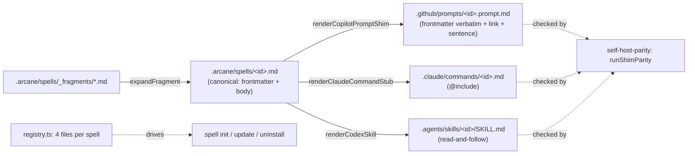
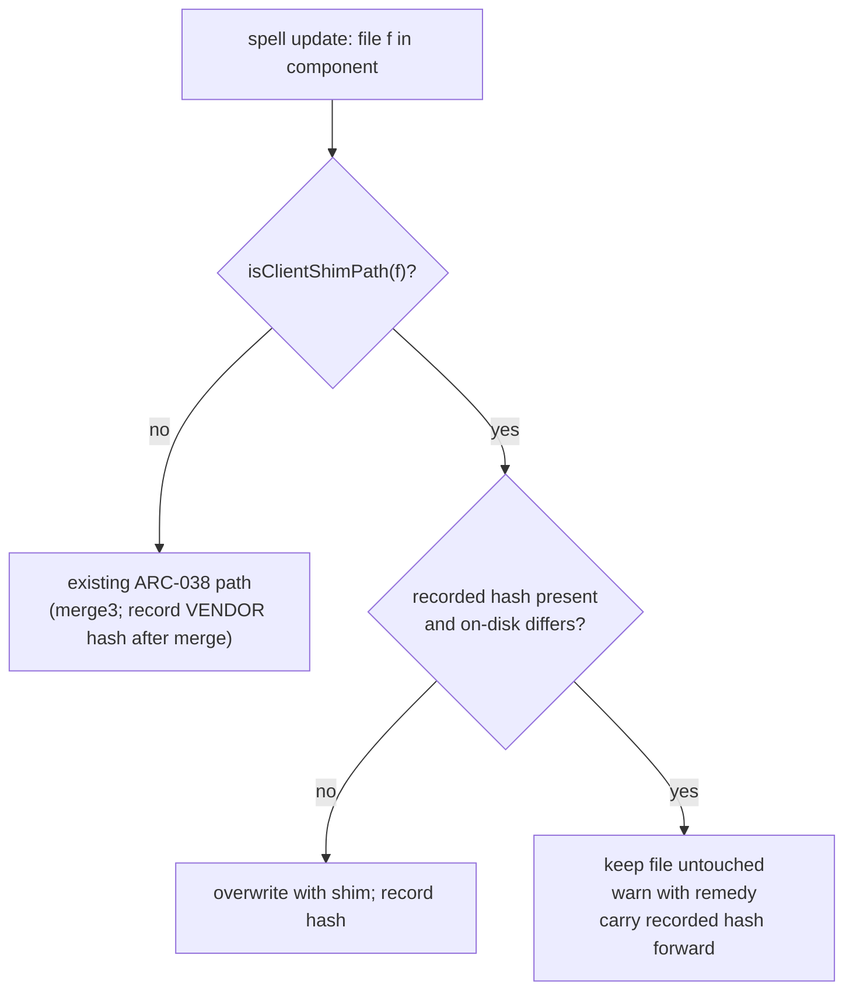
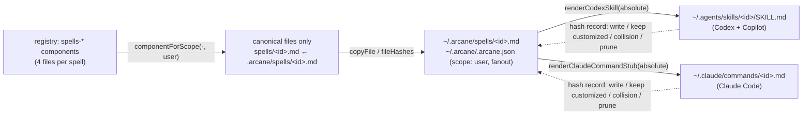
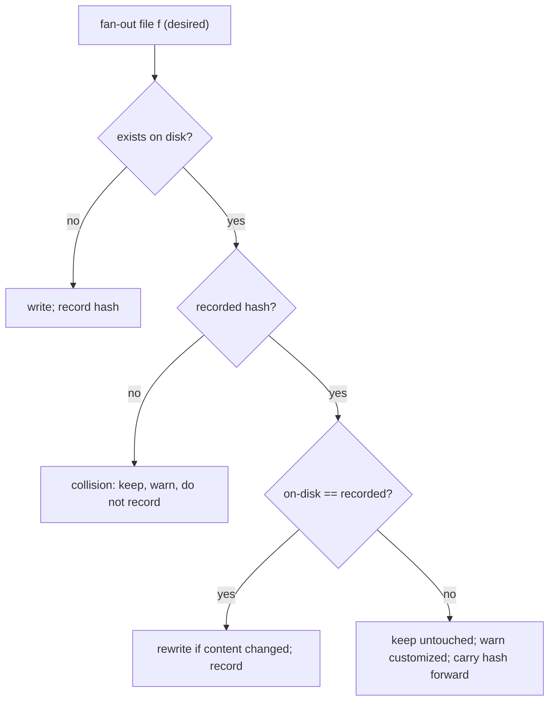

# Architecture — Codex Support

Related: [[development-methodology]] (the Spell Loop this design is executed under),
[[spell-authoring-standards]] (D2 Distributability, which the new canonical location must keep
satisfying), [[git-conventions]] (the commit-scope table that names where spells live).

This document is `spell-architect`'s output for the Codex Support program, one section per epic.
CS-01 shipped without one (its mechanism was small enough to live in the ADR); CS-03 is the
program's largest and only breaking epic, so its design is written down before it is built; CS-04
(below) introduces a new CLI surface and the first Arcane files written outside a repository, so it
is written down too.

---

## CS-03 — Canonical move: `.arcane/spells/` + every client a generated shim

### Inputs

- **Requirements:** [PRD.md](PRD.md) R2 (one client-neutral canonical source per spell — AC3, AC4)
  and R5 (no silent data loss during the migration — AC8). R1's AC1/AC2 (Codex discovery, shipped
  by CS-01) must still hold after the move — `docs/plans/codex-support/PLAN.md`'s Definition of
  Done item 3 requires re-confirmation by direct client observation.
- **Decision record:** `DECISIONS.md` ARC-045 decisions 1–2: the canonical source moves to
  `.arcane/spells/<id>.md` (the one sanctioned exception to ARC-033 decision 1); every client
  surface is a generated shim with no authored body of its own.
- **Version:** `1.0.0`, operator pre-decided at `docs/plans/codex-support/OPERATOR-QUEUE.md` Q-003;
  applied in this epic's PR, which the operator merges by hand regardless of the standing
  delegation.

### Empirical-first findings (2026-09-09, before any code was written)

Run against a real consumer fixture: `spell init --profile full` with the built `0.39.0` CLI,
committed, then **today's** `runUpdate()` pointed at a next-version asset tree in which two prompts
were already shims. Merge bases were fetched from the genuinely published npm history, not mocked.

| Variant | Operator state | What today's `spell update` does | Verdict |
|---|---|---|---|
| A | Appended lines to a prompt (hash recorded) | Three-way merge **succeeds**: the body is deleted, the shim is written, and the operator's lines dangle under it. Prints `Merged your edits into: …`. Manifest records the merged file as Arcane-written. | **False success.** The customization no longer customizes anything and nothing says so. |
| B | Edited a line inside the body (hash recorded) | Conflict markers: one operator line versus the shim sentence; the rest of the body is gone from the file, recoverable only from git. Reported as a conflict. | Visible, but the file is destroyed as a prompt. |
| C | Appended lines; manifest entry has **no** recorded hash (install predates ARC-038 / 0.32.0) | Silent overwrite with the shim. No message. | Documented pre-ARC-038 behavior; the migration notes must tell these consumers to commit first. |
| D | Edited a governance file, then ran **two** consecutive updates (`0.38.3 → 0.39.0 → next`) | Update 1 merges correctly. Update 2 **overwrites the merged file**, losing the edit. | **New defect, independent of this epic:** after a merge, `update.ts` records the *merged* file's hash, so at the next update the file looks untouched. Edits survive exactly one update. Present since 0.32.0. |

**Correction to the epic's premise, on the record:** PLAN.md framed the risk as "hash-mismatch →
conflict". The tree says the failure is worse and quieter — a merge that reports success while
orphaning the edit (A), conflict soup (B), or silence (C). The planned design (preserve, warn,
never merge a body into a shim) is the right one; it is now grounded in observed behavior rather
than the assumption. Variant D adds a fix this epic must carry for R5 to be true at all.

### Decisions

**D1 — The canonical file is the moved prompt, frontmatter intact.** `git mv
src/assets/.github/prompts/<id>.prompt.md src/assets/.arcane/spells/<id>.md` for all 41 spells,
`_fragments/` moving with them to `.arcane/spells/_fragments/`. The frontmatter block is kept
byte-for-byte: it is already the superset ARC-045 decision 1 asks for — `name`/`description`
(client-neutral), `claude_description` (Claude hint), `agent`/`argument-hint` (Copilot hints),
`last_updated`. No field is renamed; each renderer reads what it needs. Body links are untouched
except as listed under D6: `.arcane/spells/` sits at the same depth as `.github/prompts/`, so every
one of the 172 `../../…` targets in the corpus still resolves.

**D2 — Three renderers, one source, no authored prose in any shim.** In `src/modules/spell-compiler.ts`:

| Surface | Renderer | Output |
|---|---|---|
| Copilot | `renderCopilotPromptShim(id, canonicalContent)` — **new** | `.github/prompts/<id>.prompt.md`: the canonical file's frontmatter block **verbatim**, then one body paragraph: "This prompt is the Arcane `<id>` spell. Read [`.arcane/spells/<id>.md`](../../.arcane/spells/<id>.md) and follow it as the complete workflow." |
| Claude Code | `renderClaudeCommandStub(id, frontmatter)` — retargeted | `.claude/commands/<id>.md`: unchanged shape, `@.arcane/spells/<id>.md` |
| Codex | `renderCodexSkill(id, frontmatter, canonicalPath)` — retargeted by its caller | `.agents/skills/<id>/SKILL.md`: unchanged shape, reads `.arcane/spells/<id>.md` |

Why the Copilot shim copies the frontmatter verbatim rather than rendering a curated subset: VS
Code's prompt-file documentation (fetched 2026-09-09) lists `name`, `description`, `argument-hint`,
`agent`, `model`, `tools` as the recognized fields and says relative Markdown links resolve from the
prompt file's own location — but it does **not** state whether a linked file's content is attached
automatically. Copying the block means Copilot sees exactly the fields it saw before the move (zero
behavior change in its picker), and the body carries both mechanisms: the relative link, for a
client that attaches linked files, and the explicit read-and-follow sentence, for one that does not
— every one of the 41 spells runs `agent: agent`, so the model always has a file-read tool. This is
the `render()` mode variance ARC-045 anticipated, resolved as "link + instruction" rather than as an
inlined body. Two helpers become the single source of the path contract: `canonicalSpellPath(id)`
and `isClientShimPath(path)` (the three shim patterns), consumed by the parity script and by
`update`'s migration logic (D5).

**D3 — Parity: one shim axis over three targets.** `scripts/self-host-parity.ts` replaces
`runStubParity` + `runSkillParity` with `runShimParity(mode, assetsDir)`; spell ids are enumerated
from `.arcane/spells/spell-*.md` (never from a client directory); `runFragmentParity` reads
`.arcane/spells/_fragments/`. `GENERATED_ROOTS` already contains `.arcane/`, so `npm run
fix:self-host-parity` also writes the root dogfood copies of the canonical files. ARC-012/ARC-027
obligations are unchanged in shape.

**D4 — Registry: four files per spell, canonical first.** Each `spells-*` component lists, per
spell, `.arcane/spells/<id>.md`, `.github/prompts/<id>.prompt.md`, `.claude/commands/<id>.md`,
`.agents/skills/<id>/SKILL.md` — so `spell init`/`update`/`uninstall` carry the canonical file and
all three shims as one unit, and the registry test pins "exactly 4 per spell, in that order".
`LEGACY_COMPONENT_MIGRATIONS` stays a frozen literal (ARC-033 decision 3).
`scripts/spell-catalog.ts` derives spells from the `.arcane/spells/` + `.md` pair;
`src/commands/init.ts`'s summary counts canonical spells.

**D5 — `spell update` migration semantics (R5 / AC8).** In `src/commands/update.ts`'s per-file loop:

1. **Client shim + operator edit ⇒ preserve and warn, never merge.** When `isClientShimPath(file)`
   and the on-disk hash differs from the recorded one, the file is left byte-untouched, the
   canonical file is written beside it as usual (it is a new registry file), and one warning names
   the file and the remedy. The manifest **carries the previously recorded hash forward** for that
   file — recording the current (edited) hash would make the next update see "untouched" and
   overwrite it; recording nothing would drop it into the pre-ARC-038 unconditional-overwrite path.
   Carrying it forward keeps "what Arcane last wrote" true and makes the warning idempotent across
   updates. Dry-run prints the same decision with a `[dry-run] Would keep customized` prefix.
2. **Remedy path exists.** The warning's remedy is: port the edits into `.arcane/spells/<id>.md`
   (future updates three-way merge edits there), delete the customized shim, commit, run
   `spell update`. For that last step to work at the same version, the "Already up to date"
   short-circuit becomes "up to date **and** every tracked file present"; a same-version run
   restores missing tracked files and reports them. (Today a deleted tracked file only comes back
   at the next version bump — this makes that restoration available on demand, nothing more.)
   *Scoped after the Phase 5 review (findings F1/F6):* the gate and the write are the same set —
   tracked **and** absent **and** shipped by a vendor-owned component. A present file keeps its
   recorded state untouched (no re-hash, no merge), an untracked registry file is neither created
   nor claimed, and `initOnly` (EF-17) and user-owned `skipExisting` files (`TODO.md`, `.mcp.json`,
   `journal/.gitkeep`) keep their version-change-only backfill, so a file an operator deleted on
   purpose does not return on every same-version run.
3. **Variant D fix.** After a successful three-way merge, record the hash of the **vendor** content
   just installed (`srcPath`), not of the merged file. The next update then sees a mismatch, merges
   again against the correct base, and the operator's edits survive every update, not one.
4. **Pre-ARC-038 entries** (no recorded hash) keep their documented overwrite behavior; the
   `1.0.0` changelog entry tells consumers on installs older than `0.32.0` to commit before updating,
   which `spell update` already refuses to run without.

**D6 — Links inside canonical bodies.** Keep `../../` (same depth, minimal diff; the user tier in
CS-04 points shims at an absolute canonical path, and governance stays repository-owned per ARC-045
decision 5, so root-relative links would not help it either). Rewrite sibling references
`spell-x.prompt.md` → `spell-x.md` (the two real links in `spell-feedback`, the prose mentions in
`spell-arcane-version` and `spell-review`, the glob `spell-present-arcane` instructs an agent to
run, and the commit-scope rows in `spell-commit-work`/`spell-todo`). Fix the two pre-existing broken
links while the files are open: `spell-brainstorm`'s `../../../TODO.md` and `spell-arcane-version`'s
bare `(.arcane.json)`. Governance docs that pointed at `../.github/prompts/…` from
`.arcane/governance/` (already broken today) now point at `../spells/<id>.md`, which is correct.

**D7 — Every gate that enumerated `.github/prompts` enumerates the canonical folder.**
`scripts/lib/living-docs.ts` (the scan set behind `check:citations`, `check:stale-claims`,
`check:followups` — without this the prompts silently leave those gates), `check-citations.ts`'s
cited-path candidates, `check-distributed-adr-references.ts`'s `SCAN_ROOTS`, the org-token lint
call in `copy-assets.ts` (canonical `.md` files and the shims both), and the three tests that
`readdir` the prompt directory.

**D8 — Release.** `1.0.0` is applied by `npm version major` as its own `chore(release)` commit, after
the feature commits, per `spell-bump`'s convention; `CHANGELOG.md` gains `## [1.0.0]` with a
consumer migration section in the same PR (Definition of Done item 7). The PR is opened, run green,
and left for the operator — never self-merged (PLAN.md Authority & Delegation).

**D9 — Verification of the moved surfaces (DoD 3, EV-01).** Claude Code: invoke a spell through its
regenerated stub in this session and confirm the `@.arcane/spells/…` include resolves (the harness
loads the canonical body, not just the four-line stub). Codex: `codex exec` in a fixture consumer
installed from the new build, asking it to use a spell skill and report a marker from the canonical
file. Copilot: cannot be driven from this session — recorded as an operator check in the research
doc, exactly as CS-00 did. All three are appended to `docs/research/skill-discovery-smoke-tests.md`.

### Component view

### Testing strategy

- **Unit:** every renderer (golden strings, name guard, frontmatter-block extraction incl. CRLF);
  `isClientShimPath`/`canonicalSpellPath`; `runShimParity` on a temp assets tree (drift detected per
  target, repaired in `fix` mode, three outputs per id); fragment parity on the new directory;
  registry "4 per spell, canonical first"; catalog counts; org-token lint over `.arcane/spells`.
- **Integration (`test/update.test.ts`, network mocked as today):** the AC8 fixture — one
  hand-edited shim-path file, one untouched: edited file byte-identical after update, warning names
  it, untouched one replaced by the shim, canonical written, recorded hash carried forward, dry-run
  reports the same; the Variant D regression — two consecutive updates through the merge path keep
  the edit; same-version run restores a deleted tracked file and otherwise still prints "Already up
  to date.".
- **Repository gates on the real assets:** `check:self-host-parity`, `check:spell-catalog`,
  `check:adr-references`, `check:citations`, `check:stale-claims`, `check:followups`,
  `check:version-bump` (bump present), full `npm test` (the 28 repointed test files included),
  `npm run build` (org-token lint over the new folder).
- **Client observation (D9)** recorded in the research doc; Copilot deferred to the operator.

### Blast radius (from the 2026-09-09 reference map)

| Area | Files | Treatment |
|---|---:|---|
| `src/` code | 5 | `registry.ts` (41 lists), `spell-compiler.ts`, `init.ts` summary count, `types.ts` comments |
| `scripts/` | 7 | parity, catalog, org-token lint, copy-assets, adr-references, check-citations, `lib/living-docs.ts` |
| `test/` | 28 (+1 indirect) | 17 read prompt bodies through one shared `PROMPTS` constant; 8 path-only; 3 enumerate the directory |
| `src/assets/` prose | 6 | 5 governance docs + `agent-output.instructions.md` |
| `src/assets/` canonical bodies | 6 of 41 | sibling links/prose (D6) |
| Generated shims | 82 + 41 files | regenerated by `fix:self-host-parity`, zero hand edits |
| Root docs | 3 | `project.md`, README paragraph, `portable-bootstrap.md` row; historical records (`DECISIONS.md`, `TODO.md`, `docs/intake`, journals) are left as history |

### Commit plan

The move, the renderers, the parity axis, the registry, the gates and the repointed tests are one
inseparable change (the tree is red at any intermediate point) and land as **one** feature commit;
the `update` migration and the Variant D fix are a second, independently reviewable commit; docs and
the changelog a third; the research-doc re-confirmation a fourth; then `chore(release): bump version
to 1.0.0`; then program bookkeeping; then the trailer-free show-report regeneration.

### Risks and rollback

- A consumer on an older CLI is unaffected until it runs `spell update`; the migration writes
  nothing that `spell update` did not already own, and preserves anything it cannot prove untouched.
- The Copilot shim's behavior in Copilot Chat is verified only by documentation and by the model's
  file-read fallback until the operator opens VS Code — flagged in the ship report's disclosure.
- Rollback before consumers update is a revert of the PR; after, `spell update` to the reverted
  version reverses the shims the same way it introduced them (hash-matched files are replaced).

---

## CS-04 — User tier install: `--user`, the `~/.arcane` store, and the home-directory fan-out

### Inputs

- **Requirements:** [PRD.md](PRD.md) R3 (a user-level install tier for spells — AC5). This epic
  delivers the install half of AC5: one canonical spell set per machine, discoverable by every
  client from any working directory. AC5's second half — two repositories in one VS Code workspace
  showing exactly one set of `/spell-*` entries — needs CS-05's repo opt-out (until then every repo
  still carries its own shims) and an operator count in VS Code; it stays open here on purpose.
  R4/AC6/AC7 (`spell_scope`) are CS-05; agents at the user tier are CS-06.
- **Decision record:** `DECISIONS.md` ARC-045 decision 3 (a user tier at `~/.arcane/`, copied never
  linked, shims fanned out to each client's home-directory discovery location, VS Code guidance
  printed and never auto-applied) and decision 5 (the repository keeps governance, continuity and
  configuration — the tier carries spell *delivery* content only). Open question 1 of that ADR —
  the CLI surface — is resolved below as D1.
- **Version:** minor (`1.1.0`), applied by `npm version minor` in its own `chore(release)` commit.
  Self-mergeable under the `codex-support-plan` delegation.

### Empirical-first findings (2026-09-09, before any code was written)

1. **Codex follows a user-level skill to an absolute path from an unrelated working directory.**
   A probe skill at `~/.agents/skills/arcane-probe-user/SKILL.md` whose body named an absolute
   path under the session scratchpad (forward slashes, `C:/Users/…/cs04-user-target.md`) was invoked
   via `codex exec --cd <empty directory> --sandbox read-only`. Complete stdout:
   `MARKER-CS04-ABS-PATH-CONFIRMED`; the trace shows `Get-Content -Raw '<that absolute path>'`,
   no path rewriting. The probe was removed afterwards. This is the same evidence bar as CS-00's
   Test 3 (`docs/research/skill-discovery-smoke-tests.md`), one tier up, and it settles the Codex
   fan-out shape: `renderCodexSkill()` output with an absolute canonical path.
2. **VS Code has deprecated the settings this epic was planned around.** Its AI settings reference
   (fetched 2026-09-09) marks `chat.promptFilesLocations`, `chat.agentFilesLocations`,
   `chat.agentSkillsLocations` and `chat.instructionsFilesLocations` deprecated — "This setting and
   the Local agent will be removed in a future release" — and points prompt-file users at a
   migration to **agent skills**. Its agent-skills page says skills are discovered from
   `.github/skills`, `.claude/skills`, `.agents/skills` in a workspace and from `~/.copilot/skills`,
   `~/.claude/skills`, `~/.agents/skills` for the user, with `chat.useAgentSkills` on by default and
   every skill listed under `/` in the chat input. **Correction to the epic's premise, on the
   record:** PLAN.md and ARC-045 decision 3 planned a printed `chat.promptFilesLocations` snippet.
   Printing it would recommend a setting the vendor has announced it will remove, for a location
   Copilot already covers without any setting: the user-level Codex skill folder. The user tier
   therefore needs **no VS Code setting at all** and prints an informational note instead (D6).
   Corollary: because Copilot also scans `~/.claude/skills`, a Claude fan-out at
   `~/.claude/skills/<id>/SKILL.md` (the ADR's literal wording) would list every spell **twice** in
   Copilot's picker. The Claude fan-out goes to `~/.claude/commands/<id>.md` instead (D3) — Claude
   Code's personal-commands location, which its documentation keeps supported and treats as the
   same thing as a skill (`.claude/commands/deploy.md` and `.claude/skills/deploy/SKILL.md` "both
   create `/deploy` and work the same way"), and which is outside Copilot's scan set.
3. **Claude Code's user-level `@` include could not be observed from this session.** A personal
   probe command with an absolute-path `@` include was written to `~/.claude/commands/`, but the
   running session's skill list is fixed at startup (the Skill tool reports it unknown) and a nested
   `claude -p` reports "Not logged in" — a separate credential store, which an agent session must
   not work around. The file was removed. Recorded as **deferred to the operator** (Q-005), and
   mitigated by design rather than assumed: the Claude stub carries the read-and-follow sentence
   *and* the `@` include (as the repo-tier stub already does), so an include that fails to inline
   degrades to the file-read path Codex was proven to take. What the documentation does say
   (checked 2026-09-09, documentation not observation): `@` file paths "can be relative or
   absolute"; `~/.claude/commands/<command-name>.md` files are "available across all your projects
   on that machine"; and "personal takes precedence over project" when names clash (D7).
4. **`os.homedir()` follows `USERPROFILE`/`HOME` at call time** (checked with node on this
   machine): tests stub the environment, never the function — the same "spawn the real thing"
   standard `test/org-token-lint.test.ts` holds itself to. `version-check.ts` computes its home path
   at module load, which is exactly the pattern a stub cannot reach; the user-tier code resolves the
   home directory on every call.
5. **The operator's home already holds foreign skills** (28 third-party entries under
   `~/.agents/skills`, one under `~/.claude/skills`, no `~/.claude/commands`, no `~/.arcane`). The
   fan-out therefore needs a collision rule for a same-named file Arcane never wrote (D3).

### Decisions

**D1 — CLI surface: `--user` on `init`, `update`, `status`, `uninstall`.** By the Naming Test
(`naming-conventions.md`, "if an established industry term exists for the thing, use the real
term"): the per-user tier of an existing verb is an established modifier flag — `pip install
--user`, `git config --global`, `npm --global` — and reads naturally on all four verbs; a `spell
user <verb>` noun would fork every verb into two spellings for one behavior. No existing option
collides. `InstallScope = "repo" | "user"` in `types.ts`; `ArcaneManifest.scope?: InstallScope`
(absent means `repo`, so every existing manifest is unchanged), validated in `manifest.ts` like the
other enums. `SpellInitOptions`/`SpellUpdateOptions` gain `user?: boolean`; `index.ts` resolves
`targetDir` to the store (D2) when the flag is set.

**D2 — The store is `~/.arcane/`, a repo-shaped Arcane target that holds canonical spells only.**
`userTierRoot()` = `join(homedir(), ".arcane")`; the manifest is `~/.arcane/.arcane.json`; the
spells are `~/.arcane/spells/<id>.md`. The layout comes from a **scope-aware view of the registry**
rather than new copy logic: `componentForScope(component, "user")` keeps only a component's
canonical files, strips the leading `.arcane/` from the installed path (`spells/<id>.md`) and maps
each to its asset through the `sourceOverrides` mechanism the registry already has for dotfiles.
`USER_TIER_COMPONENTS` is `SPELL_COMPONENT_NAMES` (every `spells-*` component, un-profiled; the
user manifest records `profile: "full"` as the source of that set). Everything downstream is
reused unchanged: `copyFile` (its traversal guard holds — every store file is under `~/.arcane`),
`fileHashes`, `findMissingTrackedFiles` and the same-version restore, the ARC-038 three-way merge
(an operator who edits `~/.arcane/spells/<id>.md` gets exactly the merge a repo canonical file
gets), orphan reporting, `--prune`, `--dry-run`, `--force`.

Why canonical-only: the repo-tier shims are repository-relative (`@.arcane/spells/<id>.md`, "Read
`.arcane/spells/<id>.md`", `../../.arcane/spells/<id>.md`) and would be inert in the store — no
client scans `~/.arcane/.github/prompts` and the setting that could is deprecated (finding 2). The
user-level shims are rendered by the fan-out with absolute paths instead (D3). Why not
`targetDir = ~` (which would drop the registry's own shim layout straight into `~/.claude/commands`
and `~/.agents/skills`): a manifest at `~/.arcane.json`, a stray `~/.github/prompts/`, and a
traversal guard weakened to "anywhere under home" — rejected. One general fix falls out: the merge
path fetches the previously published vendor file by its **asset** path
(`sourceOverrides[file] ?? file`), which is also what a repo-tier `sourceOverrides` file needs and
never got.

**D3 — The fan-out (`src/modules/user-tier.ts`): two files per spell, at the clients' own home
discovery roots, rendered with an absolute canonical path.**

| Client(s) | File | Renderer | Why there |
|---|---|---|---|
| Codex CLI/extension **and** VS Code Copilot | `~/.agents/skills/<id>/SKILL.md` | `renderCodexSkill(id, fm, absolutePath)` | Codex reads it (CS-00 Test 2, finding 1); Copilot's default skill locations include it (finding 2) |
| Claude Code | `~/.claude/commands/<id>.md` | `renderClaudeCommandStub(id, fm, absolutePath)` — the stub gains an optional third parameter, default `canonicalSpellPath(id)` | personal commands; outside Copilot's scan set, so no double listing (finding 2) |

The absolute path is rendered with forward slashes (`C:/Users/<you>/.arcane/spells/<id>.md`) —
the form Codex accepted verbatim, valid on Windows, and free of backslash escaping inside Markdown
and YAML. No `~/.copilot/skills` (Copilot already reads `~/.agents/skills`) and no `~/.codex/skills`
(CS-00). Written with `node:fs` directly, not `copier.copyFile` — its guard forbids leaving
`targetDir`, and these files must (the OpenClaw precedent in `agent-generator.ts`, "writes outside
targetDir" by design).

The manifest records what the fan-out wrote as `fanout?: Record<string, string>`: home-relative
POSIX path (`.agents/skills/spell-plan/SKILL.md`) → SHA-256 of the content Arcane wrote. Every run
(`init --user`, `update --user`, `uninstall --user`) reconciles the desired set against that record
with the ARC-038 discipline, applied outside the store:

| On disk | Recorded | Action |
|---|---|---|
| absent | — | write, record |
| present, hash == recorded | yes | rewrite only if the rendered content changed; record |
| present, hash ≠ recorded | yes | **keep byte-untouched**, warn "customized — not overwritten", carry the recorded hash forward (CS-03 D5's rule) |
| present | **no** | **collision** with a file Arcane never wrote (an operator's own skill or command of the same name): keep, warn, do not record — never claim ownership of a file we did not write (the same rule `update.ts` applies to preserved files) |
| recorded, no longer desired (spell dropped, or uninstall) | yes | remove only if hash == recorded, then remove the emptied `<id>` directory; edited → keep + warn; already gone → drop the record |

Dry-run prints the same decisions with a `[dry-run] Would …` prefix and writes nothing.

**D4 — Command behavior under `--user`.**

- `spell init --user`: no profile prompt, no git-state checks (the store is not a repository), none
  of the manifest questions or `MANIFEST_RETROFITS` (repository semantics), no hooks, no agent
  setup. Installs `USER_TIER_COMPONENTS` into the store, writes the manifest with `scope: "user"`,
  runs the fan-out, records `fanout`, then prints the store path, the spell count, the fan-out counts
  per client, the VS Code note (D6) and two next steps (reload VS Code; `spell status --user`).
  "Already initialized" behaves as it does for a repo.
- `spell update --user`: reads the store manifest; skips the git checks and the commit-first
  warning (a hash baseline and the published vendor file are the merge inputs — no repository is
  involved); runs the ordinary update over the scope view (same-version restore included); then
  re-runs the fan-out so a renderer change regenerates every shim and a dropped spell's shims are
  pruned; retrofits are skipped for `scope: "user"`; `--dry-run` and `--prune` behave as for a
  repo.
- `spell status --user`: the store's component table, `Scope: user`, one fan-out line (`82 client
  files — 41 Claude Code commands, 41 Codex/Copilot skills; N customized, M missing`), the version
  footer. Plain `spell status` (repo) gains `Scope: repo` and, only when a user tier exists on the
  machine, `User tier: v<version> at <store> (spell status --user)`.
- `spell uninstall --user`: reconciles the fan-out against an empty desired set (hash-checked
  removal, customized files kept and listed), removes the store files and the manifest; skips the
  push-policy refusal and the repository-only cleanups (agent directories, marker sections, hooks);
  `--yes` and `--dry-run` as for a repo.
- `spell doctor`: `checkUserTier()`, non-blocking. No store → `pass`, "no user tier installed
  (optional — `spell init --user`)", the same shape as `checkMcpConfig`'s "nothing to check" row.
  Store present → `major.minor` of the store versus the CLI (differs → `warn`, remedy `spell update
  --user`) and fan-out integrity from the manifest record (missing or edited files → `warn` with
  counts and the same remedy). Reads only the store manifest and file hashes — it does not read VS
  Code's settings (profile-specific JSONC, and after finding 2 there is nothing in them to check).

**D5 — `index.ts` wiring.** One option string on all four commands: `--user` — "operate on the
per-user tier at ~/.arcane (spells shared by every repository on this machine)". The action
handlers pass `userTierRoot()` as `targetDir` and `{ user: true }` in the options; nothing else in
the command modules branches on the flag except the points D4 names.

**D6 — The VS Code note.** Printed by `init --user` and `status --user`, never applied:

> VS Code Copilot: no settings change is needed — Copilot discovers `~/.agents/skills` by default
> (`chat.useAgentSkills`, on by default) and lists each spell under `/`. Reload the window after
> installing. VS Code has deprecated `chat.promptFilesLocations`; the user tier does not use it.

ARC-045 decision 3's "printed — never auto-applied" holds; what is printed is the finding that no
setting is required, with its reason, rather than a snippet for a deprecated one.

**D7 — Coexistence and precedence are documented, not engineered away here.** Claude Code's
documented rule is "personal over project": once the user tier is installed, `/spell-*` in a repo
that still carries its own shims runs the user-tier copy. Codex and Copilot list both tiers'
entries until CS-05's repo opt-out removes the repository's. README and `status --user` say so;
CS-05 is where duplication ends.

**D8 — Tests, with the home directory stubbed by environment.** Every user-tier test sets
`process.env.USERPROFILE` and `process.env.HOME` to a fresh temp directory in `beforeEach` and
restores both in `afterEach` (the stash pattern `test/org-token-lint.test.ts` uses). Coverage in
the Testing strategy below.

**D9 — Release and records.** `1.1.0`; `CHANGELOG.md` `## [1.1.0]` (Added: the user tier; Notes:
the VS Code deprecation finding and the precedence rule); README "Once per machine" subsection
under Quick start; `portable-bootstrap.md`'s "Framework-managed spells" bullet gains the tier;
ARC-045 gains an implementation note recording D3's Claude location and D6's rationale as
implementation-level variances of decision 3; the research doc gains a "CS-04 user-tier probes"
section (findings 1 and 3); PLAN.md's CS-04 entry carries the premise correction; Q-005 asks the
operator for the Claude Code and Copilot user-level checks this session could not perform.

### Component view

### Testing strategy

- **Unit (`test/user-tier.test.ts`):** `userTierRoot()` follows the stubbed home;
  `componentForScope` keeps exactly the canonical files with stripped paths and correct
  `sourceOverrides` (and returns repo components untouched); absolute-path rendering uses forward
  slashes; the fan-out engine on a temp home — first run writes 2 files per spell and records them,
  a second run is a no-op, a renderer change rewrites and re-records, an edited file is kept and
  its hash carried forward, a same-named foreign file is kept and never recorded, a dropped spell's
  files are pruned only when hash-matched and the emptied directory goes with them, dry-run writes
  nothing and prints the decisions.
- **Command integration:** `init --user` (store layout, manifest `scope`/`fanout`, no prompt
  function called, git module untouched, `--dry-run`, "Already initialized"); `update --user`
  (same-version restore of a deleted store spell, fan-out regenerated, an edited store spell goes
  through the merge path with the network mocked, `--dry-run`); `status --user` (scope line,
  fan-out counts, customized/missing counts) and plain `status` (scope line; user-tier line only
  when a store exists); `uninstall --user` (customized shim kept and listed, everything else and
  the emptied directories removed, `--dry-run`, `--yes`); `doctor` (no store → pass; version
  mismatch → warn; missing fan-out file → warn); `manifest.ts` rejects an unsupported `scope`.
- **Repository gates on the real tree:** full `npm test`, `npm run build`, `check:version-bump`
  (bump present), `check:self-host-parity`, `check:spell-catalog`, `check:adr-references`,
  `check:citations`, `check:stale-claims`, `check:followups`.
- **Client observation (EV-01):** Codex at the user tier — observed (finding 1) and repeated
  against the real `spell init --user` output from the built CLI before uninstalling it again;
  Claude Code and Copilot at the user tier — operator (Q-005).

### Blast radius

| Area | Files | Treatment |
|---|---:|---|
| `src/` | 10 | `types.ts` (scope, fanout, options), `modules/manifest.ts` (scope validation), **new** `modules/user-tier.ts`, `modules/spell-compiler.ts` (optional canonical-ref parameter), `commands/init.ts`, `update.ts`, `status.ts`, `uninstall.ts`, `doctor.ts`, `index.ts` |
| `test/` | 7 | new `user-tier.test.ts`, `doctor-user-tier.test.ts`; `--user` cases in `init`, `update`, `status`, `uninstall`; a `scope` case beside the existing manifest-field tests |
| Distributed prose | 1 | `portable-bootstrap.md` (source + root copy via parity) |
| Root docs | 6 | README, CHANGELOG, DECISIONS.md (implementation note), research doc, PLAN.md, OPERATOR-QUEUE.md |

### Commit plan

Architecture and stories first (this commit, with the consumed handoff marker and two Low drift
fixes from the session opener). The feature lands as **one** commit — types, manifest validation,
the module, the compiler parameter, the five command edits, the wiring and every test, because the
tree is red at any intermediate point. Then docs and changelog; then `chore(release): bump version
to 1.1.0`; then program bookkeeping; then the trailer-free show-report regeneration.

### Risks and rollback

- Nothing here changes a repository install: `scope` is optional and absent, `fanout` is written
  only by `--user`, and no repo-tier code path reads either. Rollback for a consumer is `spell
  uninstall --user`, which removes only hash-matched files and reports what it left.
- The Claude Code user-level include is verified by documentation and the read-and-follow fallback
  until the operator runs Q-005 — disclosed in the ship report, as CS-03 disclosed Copilot.
- A future VS Code that drops `~/.agents/skills` from its defaults would need a Copilot-specific
  fan-out target; `CLIENT_SHIM_PATHS`-style, one renderer line, no redesign.
