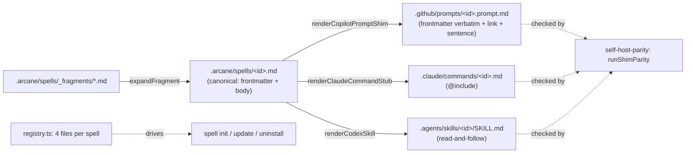
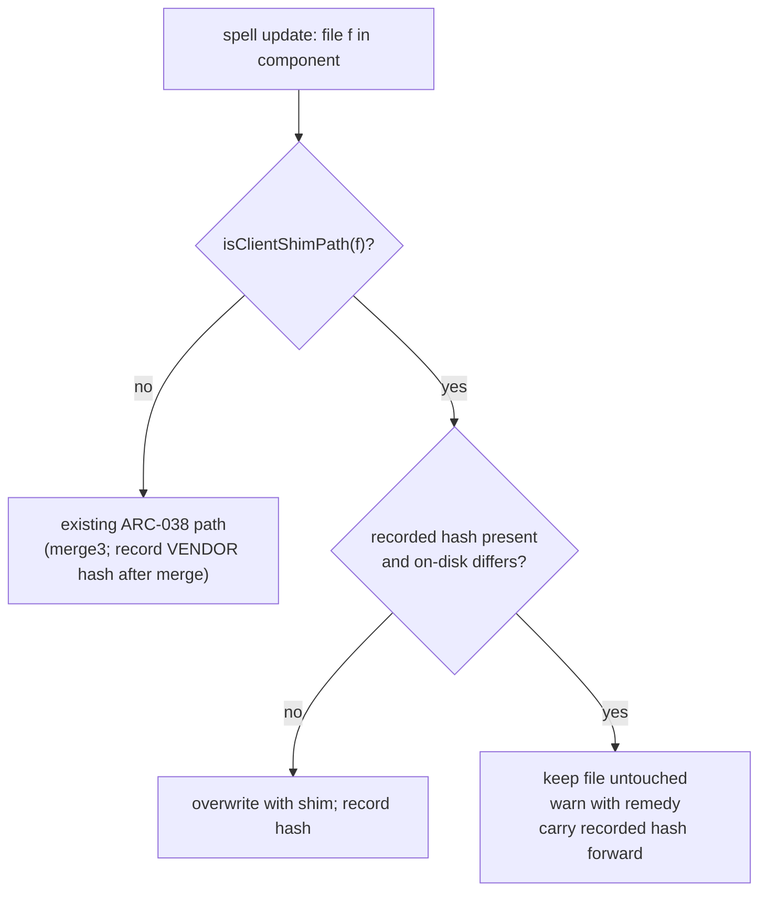

# Architecture — Codex Support

Related: [[development-methodology]] (the Spell Loop this design is executed under),
[[spell-authoring-standards]] (D2 Distributability, which the new canonical location must keep
satisfying), [[git-conventions]] (the commit-scope table that names where spells live).

This document is `spell-architect`'s output for the Codex Support program, one section per epic.
CS-01 shipped without one (its mechanism was small enough to live in the ADR); CS-03 is the
program's largest and only breaking epic, so its design is written down before it is built.

---

## CS-03 — Canonical move: `.arcane/spells/` + every client a generated shim

### Inputs

- **Requirements:** [PRD.md](PRD.md) R2 (one client-neutral canonical source per spell — AC3, AC4)
  and R5 (no silent data loss during the migration — AC8). R1's AC1/AC2 (Codex discovery, shipped
  by CS-01) must still hold after the move — `docs/plans/codex-support/PLAN.md`'s Definition of
  Done item 3 requires re-confirmation by direct client observation.
- **Decision record:** `DECISIONS.md` ARC-045 decisions 1–2: the canonical source moves to
  `.arcane/spells/<id>.md` (the one sanctioned exception to ARC-033 decision 1); every client
  surface is a generated shim with no authored body of its own.
- **Version:** `1.0.0`, operator pre-decided at `docs/plans/codex-support/OPERATOR-QUEUE.md` Q-003;
  applied in this epic's PR, which the operator merges by hand regardless of the standing
  delegation.

### Empirical-first findings (2026-09-09, before any code was written)

Run against a real consumer fixture: `spell init --profile full` with the built `0.39.0` CLI,
committed, then **today's** `runUpdate()` pointed at a next-version asset tree in which two prompts
were already shims. Merge bases were fetched from the genuinely published npm history, not mocked.

| Variant | Operator state | What today's `spell update` does | Verdict |
|---|---|---|---|
| A | Appended lines to a prompt (hash recorded) | Three-way merge **succeeds**: the body is deleted, the shim is written, and the operator's lines dangle under it. Prints `Merged your edits into: …`. Manifest records the merged file as Arcane-written. | **False success.** The customization no longer customizes anything and nothing says so. |
| B | Edited a line inside the body (hash recorded) | Conflict markers: one operator line versus the shim sentence; the rest of the body is gone from the file, recoverable only from git. Reported as a conflict. | Visible, but the file is destroyed as a prompt. |
| C | Appended lines; manifest entry has **no** recorded hash (install predates ARC-038 / 0.32.0) | Silent overwrite with the shim. No message. | Documented pre-ARC-038 behavior; the migration notes must tell these consumers to commit first. |
| D | Edited a governance file, then ran **two** consecutive updates (`0.38.3 → 0.39.0 → next`) | Update 1 merges correctly. Update 2 **overwrites the merged file**, losing the edit. | **New defect, independent of this epic:** after a merge, `update.ts` records the *merged* file's hash, so at the next update the file looks untouched. Edits survive exactly one update. Present since 0.32.0. |

**Correction to the epic's premise, on the record:** PLAN.md framed the risk as "hash-mismatch →
conflict". The tree says the failure is worse and quieter — a merge that reports success while
orphaning the edit (A), conflict soup (B), or silence (C). The planned design (preserve, warn,
never merge a body into a shim) is the right one; it is now grounded in observed behavior rather
than the assumption. Variant D adds a fix this epic must carry for R5 to be true at all.

### Decisions

**D1 — The canonical file is the moved prompt, frontmatter intact.** `git mv
src/assets/.github/prompts/<id>.prompt.md src/assets/.arcane/spells/<id>.md` for all 41 spells,
`_fragments/` moving with them to `.arcane/spells/_fragments/`. The frontmatter block is kept
byte-for-byte: it is already the superset ARC-045 decision 1 asks for — `name`/`description`
(client-neutral), `claude_description` (Claude hint), `agent`/`argument-hint` (Copilot hints),
`last_updated`. No field is renamed; each renderer reads what it needs. Body links are untouched
except as listed under D6: `.arcane/spells/` sits at the same depth as `.github/prompts/`, so every
one of the 172 `../../…` targets in the corpus still resolves.

**D2 — Three renderers, one source, no authored prose in any shim.** In `src/modules/spell-compiler.ts`:

| Surface | Renderer | Output |
|---|---|---|
| Copilot | `renderCopilotPromptShim(id, canonicalContent)` — **new** | `.github/prompts/<id>.prompt.md`: the canonical file's frontmatter block **verbatim**, then one body paragraph: "This prompt is the Arcane `<id>` spell. Read [`.arcane/spells/<id>.md`](../../.arcane/spells/<id>.md) and follow it as the complete workflow." |
| Claude Code | `renderClaudeCommandStub(id, frontmatter)` — retargeted | `.claude/commands/<id>.md`: unchanged shape, `@.arcane/spells/<id>.md` |
| Codex | `renderCodexSkill(id, frontmatter, canonicalPath)` — retargeted by its caller | `.agents/skills/<id>/SKILL.md`: unchanged shape, reads `.arcane/spells/<id>.md` |

Why the Copilot shim copies the frontmatter verbatim rather than rendering a curated subset: VS
Code's prompt-file documentation (fetched 2026-09-09) lists `name`, `description`, `argument-hint`,
`agent`, `model`, `tools` as the recognized fields and says relative Markdown links resolve from the
prompt file's own location — but it does **not** state whether a linked file's content is attached
automatically. Copying the block means Copilot sees exactly the fields it saw before the move (zero
behavior change in its picker), and the body carries both mechanisms: the relative link, for a
client that attaches linked files, and the explicit read-and-follow sentence, for one that does not
— every one of the 41 spells runs `agent: agent`, so the model always has a file-read tool. This is
the `render()` mode variance ARC-045 anticipated, resolved as "link + instruction" rather than as an
inlined body. Two helpers become the single source of the path contract: `canonicalSpellPath(id)`
and `isClientShimPath(path)` (the three shim patterns), consumed by the parity script and by
`update`'s migration logic (D5).

**D3 — Parity: one shim axis over three targets.** `scripts/self-host-parity.ts` replaces
`runStubParity` + `runSkillParity` with `runShimParity(mode, assetsDir)`; spell ids are enumerated
from `.arcane/spells/spell-*.md` (never from a client directory); `runFragmentParity` reads
`.arcane/spells/_fragments/`. `GENERATED_ROOTS` already contains `.arcane/`, so `npm run
fix:self-host-parity` also writes the root dogfood copies of the canonical files. ARC-012/ARC-027
obligations are unchanged in shape.

**D4 — Registry: four files per spell, canonical first.** Each `spells-*` component lists, per
spell, `.arcane/spells/<id>.md`, `.github/prompts/<id>.prompt.md`, `.claude/commands/<id>.md`,
`.agents/skills/<id>/SKILL.md` — so `spell init`/`update`/`uninstall` carry the canonical file and
all three shims as one unit, and the registry test pins "exactly 4 per spell, in that order".
`LEGACY_COMPONENT_MIGRATIONS` stays a frozen literal (ARC-033 decision 3).
`scripts/spell-catalog.ts` derives spells from the `.arcane/spells/` + `.md` pair;
`src/commands/init.ts`'s summary counts canonical spells.

**D5 — `spell update` migration semantics (R5 / AC8).** In `src/commands/update.ts`'s per-file loop:

1. **Client shim + operator edit ⇒ preserve and warn, never merge.** When `isClientShimPath(file)`
   and the on-disk hash differs from the recorded one, the file is left byte-untouched, the
   canonical file is written beside it as usual (it is a new registry file), and one warning names
   the file and the remedy. The manifest **carries the previously recorded hash forward** for that
   file — recording the current (edited) hash would make the next update see "untouched" and
   overwrite it; recording nothing would drop it into the pre-ARC-038 unconditional-overwrite path.
   Carrying it forward keeps "what Arcane last wrote" true and makes the warning idempotent across
   updates. Dry-run prints the same decision with a `[dry-run] Would keep customized` prefix.
2. **Remedy path exists.** The warning's remedy is: port the edits into `.arcane/spells/<id>.md`
   (future updates three-way merge edits there), delete the customized shim, run `spell update`.
   For that last step to work at the same version, the "Already up to date" short-circuit becomes
   "up to date **and** every tracked file present"; a same-version run restores missing tracked
   files and reports them. (Today a deleted tracked file only comes back at the next version bump —
   this makes that restoration available on demand, nothing more.)
3. **Variant D fix.** After a successful three-way merge, record the hash of the **vendor** content
   just installed (`srcPath`), not of the merged file. The next update then sees a mismatch, merges
   again against the correct base, and the operator's edits survive every update, not one.
4. **Pre-ARC-038 entries** (no recorded hash) keep their documented overwrite behavior; the
   `1.0.0` changelog entry tells consumers on installs older than `0.32.0` to commit before updating,
   which `spell update` already refuses to run without.

**D6 — Links inside canonical bodies.** Keep `../../` (same depth, minimal diff; the user tier in
CS-04 points shims at an absolute canonical path, and governance stays repository-owned per ARC-045
decision 5, so root-relative links would not help it either). Rewrite sibling references
`spell-x.prompt.md` → `spell-x.md` (the two real links in `spell-feedback`, the prose mentions in
`spell-arcane-version` and `spell-review`, the glob `spell-present-arcane` instructs an agent to
run, and the commit-scope rows in `spell-commit-work`/`spell-todo`). Fix the two pre-existing broken
links while the files are open: `spell-brainstorm`'s `../../../TODO.md` and `spell-arcane-version`'s
bare `(.arcane.json)`. Governance docs that pointed at `../.github/prompts/…` from
`.arcane/governance/` (already broken today) now point at `../spells/<id>.md`, which is correct.

**D7 — Every gate that enumerated `.github/prompts` enumerates the canonical folder.**
`scripts/lib/living-docs.ts` (the scan set behind `check:citations`, `check:stale-claims`,
`check:followups` — without this the prompts silently leave those gates), `check-citations.ts`'s
cited-path candidates, `check-distributed-adr-references.ts`'s `SCAN_ROOTS`, the org-token lint
call in `copy-assets.ts` (canonical `.md` files and the shims both), and the three tests that
`readdir` the prompt directory.

**D8 — Release.** `1.0.0` is applied by `npm version major` as its own `chore(release)` commit, after
the feature commits, per `spell-bump`'s convention; `CHANGELOG.md` gains `## [1.0.0]` with a
consumer migration section in the same PR (Definition of Done item 7). The PR is opened, run green,
and left for the operator — never self-merged (PLAN.md Authority & Delegation).

**D9 — Verification of the moved surfaces (DoD 3, EV-01).** Claude Code: invoke a spell through its
regenerated stub in this session and confirm the `@.arcane/spells/…` include resolves (the harness
loads the canonical body, not just the four-line stub). Codex: `codex exec` in a fixture consumer
installed from the new build, asking it to use a spell skill and report a marker from the canonical
file. Copilot: cannot be driven from this session — recorded as an operator check in the research
doc, exactly as CS-00 did. All three are appended to `docs/research/skill-discovery-smoke-tests.md`.

### Component view

### Testing strategy

- **Unit:** every renderer (golden strings, name guard, frontmatter-block extraction incl. CRLF);
  `isClientShimPath`/`canonicalSpellPath`; `runShimParity` on a temp assets tree (drift detected per
  target, repaired in `fix` mode, three outputs per id); fragment parity on the new directory;
  registry "4 per spell, canonical first"; catalog counts; org-token lint over `.arcane/spells`.
- **Integration (`test/update.test.ts`, network mocked as today):** the AC8 fixture — one
  hand-edited shim-path file, one untouched: edited file byte-identical after update, warning names
  it, untouched one replaced by the shim, canonical written, recorded hash carried forward, dry-run
  reports the same; the Variant D regression — two consecutive updates through the merge path keep
  the edit; same-version run restores a deleted tracked file and otherwise still prints "Already up
  to date.".
- **Repository gates on the real assets:** `check:self-host-parity`, `check:spell-catalog`,
  `check:adr-references`, `check:citations`, `check:stale-claims`, `check:followups`,
  `check:version-bump` (bump present), full `npm test` (the 28 repointed test files included),
  `npm run build` (org-token lint over the new folder).
- **Client observation (D9)** recorded in the research doc; Copilot deferred to the operator.

### Blast radius (from the 2026-09-09 reference map)

| Area | Files | Treatment |
|---|---:|---|
| `src/` code | 5 | `registry.ts` (41 lists), `spell-compiler.ts`, `init.ts` summary count, `types.ts` comments |
| `scripts/` | 7 | parity, catalog, org-token lint, copy-assets, adr-references, check-citations, `lib/living-docs.ts` |
| `test/` | 28 (+1 indirect) | 17 read prompt bodies through one shared `PROMPTS` constant; 8 path-only; 3 enumerate the directory |
| `src/assets/` prose | 6 | 5 governance docs + `agent-output.instructions.md` |
| `src/assets/` canonical bodies | 6 of 41 | sibling links/prose (D6) |
| Generated shims | 82 + 41 files | regenerated by `fix:self-host-parity`, zero hand edits |
| Root docs | 3 | `project.md`, README paragraph, `portable-bootstrap.md` row; historical records (`DECISIONS.md`, `TODO.md`, `docs/intake`, journals) are left as history |

### Commit plan

The move, the renderers, the parity axis, the registry, the gates and the repointed tests are one
inseparable change (the tree is red at any intermediate point) and land as **one** feature commit;
the `update` migration and the Variant D fix are a second, independently reviewable commit; docs and
the changelog a third; the research-doc re-confirmation a fourth; then `chore(release): bump version
to 1.0.0`; then program bookkeeping; then the trailer-free show-report regeneration.

### Risks and rollback

- A consumer on an older CLI is unaffected until it runs `spell update`; the migration writes
  nothing that `spell update` did not already own, and preserves anything it cannot prove untouched.
- The Copilot shim's behavior in Copilot Chat is verified only by documentation and by the model's
  file-read fallback until the operator opens VS Code — flagged in the ship report's disclosure.
- Rollback before consumers update is a revert of the PR; after, `spell update` to the reverted
  version reverses the shims the same way it introduced them (hash-matched files are replaced).
