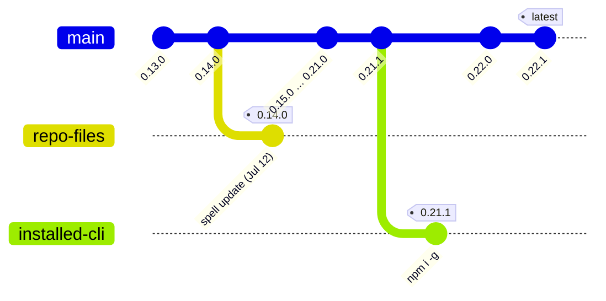

# PRD — Generated State Diagrams (Deterministic Mermaid for Computed Spell State)

## Problem

Rule 8 (`universal-agent-rules.md:36`) mandates Mermaid, but only for *explanatory* diagrams —
flow charts, architecture, sequences — and only three spells act on it (`spell-architect`,
`spell-scope`, `spell-explain-concept`), each authoring diagrams freehand. No convention covers
diagrams *derived from state a spell already computed*. A 36-spell sweep (2026-08-30,
arcane-website dogfooding) found seven spells reporting topology or state as prose, and zero uses
of `gitGraph` anywhere in the repository.

The motivating case: `spell-open-session`'s two-axis version check
(`spell-open-session.prompt.md:93-100`) computes three readings — the repo's managed-files version
from `.arcane.json`, the installed CLI version, npm latest — and emits two prose warnings. The
drift *is* a git graph (npm releases = `main`; each consumer forks at its last-synced version),
yet the operator gets sentences. In the incident that seeded this PRD the readings were
0.14.0 / 0.21.1 / 0.22.1, and "why is the upgrade split in two?" took paragraphs to answer; the
diagram below answers it at a glance.

The CLI is weaker still: `src/commands/status.ts` prints per-component versions and the npm-latest
footer but never compares `manifest.version` to `packageVersion` — axis A (files behind the
installed CLI) is mandated in spell prose and invisible in the CLI, even though all three values
are in scope at `status.ts:91-99`.

## Positioning

Arcane becomes the methodology that **draws its own state**. Generated diagrams are
markdown-native — they render in VS Code chat, GitHub, and Obsidian, and degrade to readable
fenced source in bare terminals (ADO wikis take the `:::mermaid` fence — a real requirement, R5).
No other AI dev framework auto-visualizes its own governance, version, or session state.

## The canonical Tier-1 shape (worked example from the seeding incident)



Axis A = the `repo-files` fork point vs the `installed-cli` fork point (fix: `spell update`);
axis B = `installed-cli` vs `main`'s head (fix: upgrade the global CLI). The two dangling branches
*are* the two axes — no legend needed. Suppressed entirely when all three readings match.

## Requirements

### Must Have — Tier 1: the convention + the version-drift diagram

| # | Requirement | Acceptance Criteria |
|---|---|---|
| R1 | Convention + guard recorded: [ARC-036](../../DECISIONS.md#arc-036--generated-state-diagrams-deterministic-mermaid-for-computed-spell-state) names "generated state diagrams"; rule 8 extended additively | Rule 8's existing sentence byte-unchanged; extension ≤3 sentences including the when-NOT-to-emit guard; ARC-036 lean-format with Naming impact |
| R2 | One canonical deterministic `gitGraph` template for the three readings | Shape above: npm releases = `main`; `repo-files` and `installed-cli` branches forked at last-synced versions; gap labels axis A (`spell update`) / axis B (upgrade CLI); character-deterministic given the three values; suppressed when all three match (guard applied) |
| R3 | `spell-open-session`'s two-axis check emits the diagram beside its existing warnings | Built only from the three already-computed values; no new network calls; absent when the check is skipped or npm is unreachable |
| R4 | `spell-arcane-version` emits the same diagram — and gains the third reading | Its update check today compares only `.arcane.json` vs npm; adds the installed-CLI reading (`arcane --version`); one prompt holds the canonical template, the other references it (D8) |
| R5 | Tracker-aware fencing | Default ` ```mermaid `; documented `:::mermaid` variant when the output surface is an ADO wiki, keyed to `external_provider` (ARC-032), never an org literal; degrade-to-readable-source note for bare terminals |
| R6 | Inline enforcement (ARC-023) | New `test/prompt-diagram-emission.test.ts` string-asserts template + guard presence in both prompts, following the `test/prompt-pending-verification.test.ts` pattern |
| R7 | Release mechanics honored | Implementation PR carries the version bump, `npm run fix:self-host-parity`, and green org-token lint; the maintainer-internal exemption (spell-authoring-standards) is cited for `arcane-cli`/registry references |

### Should Have — Tiers 2–3: CLI parity, computed-state adopters, harmonization

| # | Requirement | Acceptance Criteria |
|---|---|---|
| R8 | CLI parity: `spell status` renders the same diagram and closes the axis-A gap | `status.ts` compares `manifest.version` vs `packageVersion` (missing today); a `src/modules` pure generator (sibling to `version-check.ts`) emits the R2 shape; TTY behavior per Open Question 2 |
| R9 | Branch/PR topology `gitGraph` in `spell-commit-work` + `spell-create-pull-request` (zero prior art) | Derived only from git state the spells already read; guard skips trivial single-branch/no-remote states |
| R10 | Topology/state adopters: `spell-review-batch` (multi-PR/repo + GO/NO-GO), `spell-manifest` (7-way routing + multi-repo), `spell-full-cycle` (pipeline state machine), `spell-close-session` (session timeline) | Each emits from data already gathered; each references the convention, never restates it |
| R11 | Tier-3 harmonization | `spell-explain-concept`/`spell-architect`/`spell-scope` prescriptions repointed to the one convention; explain-concept's "Don't use diagrams for simple definitions" retained verbatim as the guard's origin; `spell-security-review`'s trust-boundary/data-flow diagram joins here as agent-authored analysis under rule 8 (post-review reclassification — analysis output, not recorded state) |

### Won't Have (this iteration)

- Anti-candidates stay diagram-free **by contract** and are named in the guard, not edited
  per-spell: `spell-status` (one-line contract), `spell-save-idea` (speed rule), `spell-bump`,
  `spell-dotnet-expert`, `spell-generate-bot-icons`.
- No rendered images, SVG output, or rendering service — the markdown-native pillar stands.
- No model-judgment diagrams in Tiers 1–2 — deterministic/data-derived only (Tier 3's explanatory
  diagrams remain agent-authored under existing rule 8).
- The CLI generator does not ride in the Tier-1 PR (see Decision note below).

**Decision note — CLI generator is Should, not Must:** Tier-1 value lands entirely in prompts,
where the three readings already exist and where drift is actually experienced (session open); CLI
emission carries the unresolved TTY/renderer questions; keeping the Must PR prompt-only matches the
handoff-durability precedent and decouples the bump-heavy TypeScript work; and the `status.ts`
axis-A fix riding with R8 gives the CLI slice independent defect-fix value.

## Constraints

- This PRD's promotion PR is docs-only (no version bump). Every rule-8, prompt, and CLI edit is
  implementation work: `src/assets/` → version bump + `fix:self-host-parity`; root dogfood copies
  are never hand-edited.
- The applicability guard is mandatory, or D5/D8 rubric scores fall — restraint is part of the
  convention, not an afterthought.
- D2 Distributability and D7 Safety remain hard gates; the maintainer-internal exemption covers
  the version-drift content's framework self-references.
- The `gitGraph` template must render on GitHub, VS Code, and Obsidian's bundled Mermaid versions
  — prototype before locking the template (Open Question 1).

## Dependencies

Rule 8 (`universal-agent-rules.md:36`); `spell-open-session.prompt.md:93-100`;
`spell-arcane-version.prompt.md`'s update check; ARC-014 (authoring standards), ARC-023 (inline
enforcement), ARC-027 (self-host parity), ARC-032 (`external_provider` for R5);
`src/commands/status.ts` + `src/modules/version-check.ts` for R8.

## Open Questions

1. Is `gitGraph` legible for the three-readings/two-gaps story across all three renderers, or does
   the template need a `flowchart LR` fallback shape?
2. CLI TTY behavior for R8 — always print fenced Mermaid source, or an aligned text table when
   stdout is a TTY and the fenced block only when piped?
3. Canonical template home: `spell-open-session` (holds all three readings today) vs
   `spell-arcane-version` vs a governance snippet — a D8 (single source) vs D3 (context-file
   robustness) tension.
4. Does `:::mermaid` surface detection live in prompt logic now, or wait for the spell-compiler
   render-time injection idea (IDEAS 2026-08-02, `[#spell-compiler]`)?
5. When `.arcane.json` lacks sync history, are fork-point versions knowable, or does the template
   degrade to a two-node-per-branch shape?
