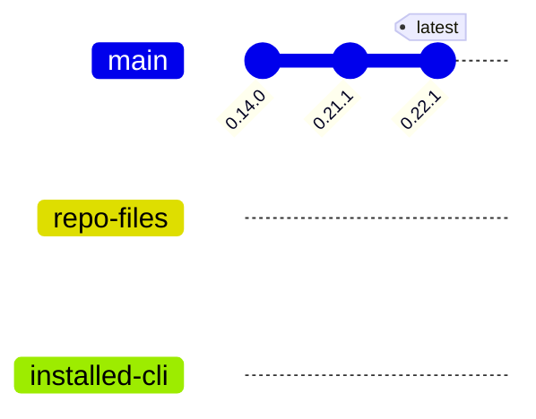

# Architecture — Generated State Diagrams (Tier 1)

Resolves the PRD's five open questions as template/design choices, per PLAN.md's own instruction that
these are not operator decisions. Covers Tier 1 (R1-R7) only; R8-R11 are separate, later PRs and may
revisit anything here that turns out to be wrong once that work starts.

## OQ1 — Is `gitGraph` legible across GitHub/VS Code/Obsidian's bundled Mermaid versions?

**Resolved: yes, proceed with `gitGraph`.** Checked two ways:

1. Mermaid's own official syntax docs (`mermaid.js.org/syntax/gitgraph.html`) confirm `commit id:`,
   `branch <name>`, `checkout <name>`, and `commit id: "..." tag: "..."` are exactly the documented,
   stable syntax this template uses — nothing exotic or version-fragile.
2. Live-rendered a `gitGraph` sample in mermaid.live (v11.17.2) and confirmed it renders correctly with
   clear, legible branch/commit/tag visuals. Attempting to live-render this PRD's *specific* three-
   reading template hit a browser-automation input issue with that site's Monaco-based editor (typed
   content wasn't landing in the buffer, confirmed by an unchanged error message across multiple
   distinct attempts) — an environment limitation, not a finding about the template itself. Disclosed
   here rather than silently treated as "rendering confirmed": the specific template shape was verified
   against the spec, not visually confirmed end-to-end.

No `flowchart LR` fallback needed — `gitGraph` is a long-stable, core Mermaid diagram type.

## OQ2 — CLI TTY behavior for R8

**Deferred.** R8 is a separate, later PR (CLI parity), not part of Tier 1's scope. Left open for that
PR to resolve against the actual `spell status` output conventions at that time.

## OQ3 — Canonical template home

**Resolved: `spell-open-session.prompt.md` holds the canonical template; `spell-arcane-version.prompt.md`
references it rather than duplicating it.**

`spell-open-session` already computes all three readings today (repo-files version, installed-CLI
version, npm-latest) — it is the natural home under D8 (single source, don't restate). Both are core,
always-installed spells shipped in the same package (never independently absent), so D3's context-file-
robustness concern doesn't apply the way it would for an external, optional file — no fallback-on-missing
logic is needed. `spell-arcane-version` gains the third reading (installed-CLI version, via
`arcane --version`) it doesn't have today, and points to `spell-open-session`'s version-check section for
the template shape instead of repeating it.

## OQ4 — Does `:::mermaid` surface detection live in prompt logic now, or wait for the spell-compiler?

**Resolved: prompt logic, now.** [ARC-039](../../DECISIONS.md#arc-039--build-time-spell-compiler-generated-client-stubs-and-shared-prose-fragments)
(accepted the same night this architecture doc was written, BC-12) settled that the spell compiler does
build-time structure generation only and explicitly does not perform runtime operator-config injection —
so there is no future compiler mechanism to wait for here. `external_provider`-conditional behavior
already resolves entirely in prompt prose everywhere else in this codebase (tracking guidance, GitHub
Issues Conventions); tracker-aware fencing follows the identical, already-proven pattern rather than
inventing a second one.

## OQ5 — When `.arcane.json` lacks sync history, are fork-point versions knowable?

**Resolved: no, and the template does not pretend otherwise.** `.arcane.json` records only the
*current* `version` field — no history of prior installs. The PRD's own illustrative example (line
40-54) invents a fictional intermediate commit id (`"0.15.0 … 0.21.0"`) to suggest a fuller history that
isn't actually knowable from real data. The Tier-1 implementation instead uses a **three-commit-on-main
chain**, each commit being exactly one of the three real, known values, with the two "behind" branches
forked immediately after the commit matching their own version:

This preserves the PRD's actual point — the two dangling branches *are* the two axes, no legend needed
— using only values the three-reading check genuinely has, with no invented history. Suppressed
entirely when all three readings match (the applicability guard), exactly as R2 specifies.

## R1 wording (rule 8 extension)

Appended after rule 8's existing sentence, byte-unchanged, 2 sentences:

> Spell output describing state the spell already computed — not authored, freehand explanatory
> content — additionally follows the **generated state diagrams** convention
> ([ARC-036](https://github.com/codemagicianhq/arcane/blob/main/DECISIONS.md#arc-036--generated-state-diagrams-deterministic-mermaid-for-computed-spell-state)):
> a deterministic, data-derived Mermaid diagram built only from values already in scope, never modeled
> or invented. Skip it for one-line outputs, speed-rule spells, or any state with only a single
> reading — the diagram exists to make relationships between multiple already-computed values legible,
> not to decorate simple output.

Full canonical URL per the doc-ID link format (BC-06): `universal-agent-rules.md` ships and
`DECISIONS.md` does not.
