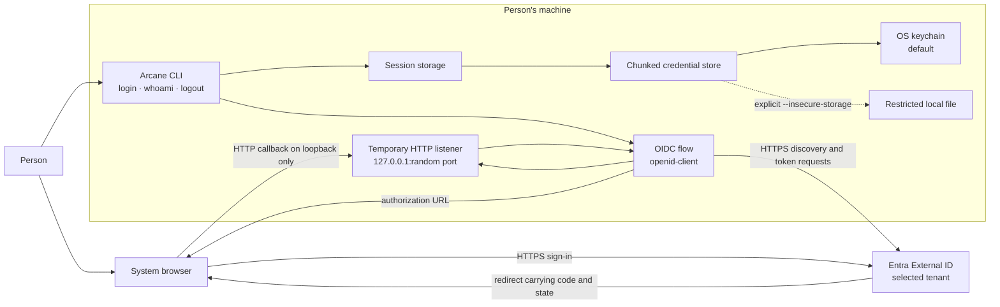
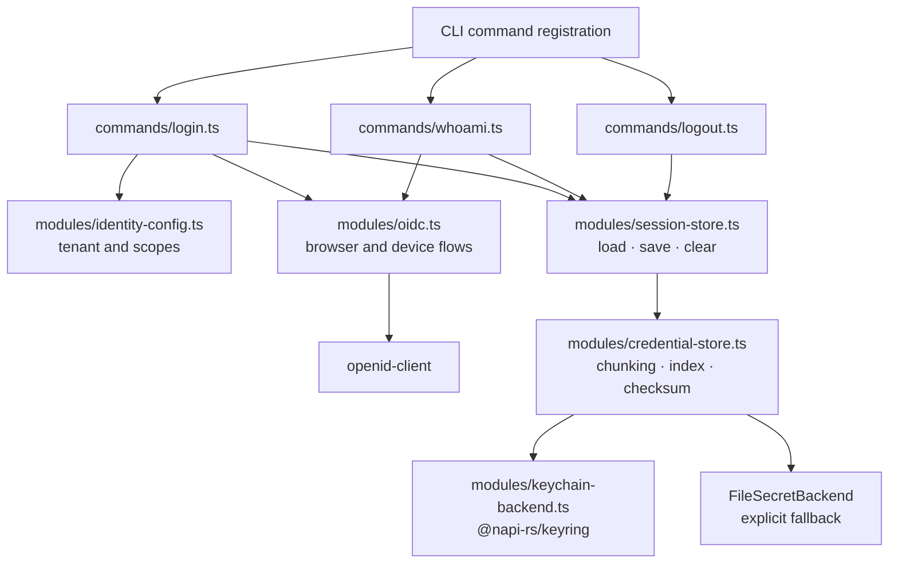

# Architecture — spell login

Related: [[features/spell-login/PRD|Spell login PRD]], [[features/spell-login/manual-acceptance-2026-10-07|manual acceptance]], [[features/spell-login/assessments/review-2026-10-07|callback review]]

This maps the implemented CLI sign-in flow at draft PR #349. Authentication establishes which account signed in and stores a local session. Product authorization—deciding which capabilities or projects that account may use—is not implemented in this release. The CLI remains usable signed out.

## System architecture



The CLI selects production by default or development with `ARCANE_ENVIRONMENT=dev`. The listener binds to `127.0.0.1` on a free port and closes on completion, timeout, or failure. The fixed browser result page contains no account details or tokens. The callback URL still contains the authorization code; a query-free result route and response-header hardening are tracked separately before integrating a visual Gate page.

Only the refresh token, `sub`, email, environment, acquisition time, and access-token expiry hint are stored. Access and ID tokens are not stored. The default keychain uses multiple credential entries because a real refresh token exceeds the measured Windows entry limit. The file fallback requires an explicit flag and prints a warning.

## Browser sign-in sequence

```mermaid
sequenceDiagram
    autonumber
    actor Person
    participant CLI as runLogin
    participant OIDC as oidc.ts / openid-client
    participant Browser
    participant IdP as Entra External ID
    participant Loopback as 127.0.0.1 listener
    participant Store as SessionStorage
    Person->>CLI: spell login
    CLI->>OIDC: Load tenant discovery over HTTPS
    OIDC->>Loopback: Listen on a random local port
    OIDC->>OIDC: Create PKCE verifier, state, nonce
    OIDC->>Browser: Open authorization URL
    Browser->>IdP: Authenticate person
    IdP-->>Browser: Redirect with code and state
    Browser->>Loopback: GET callback with code and state
    Loopback->>OIDC: Pass callback URL
    OIDC->>IdP: Exchange code using PKCE verifier
    IdP-->>OIDC: Tokens and ID-token claims
    Note over OIDC,IdP: Provider checks PKCE. Client checks state, nonce, ID token, refresh token, and sub
    alt Validation and storage succeed
        OIDC->>CLI: onValidated with token result
        CLI->>Store: Save refresh token and metadata
        Store-->>CLI: Saved
        CLI-->>OIDC: Persistence complete
        OIDC-->>Loopback: Success response
        Loopback-->>Browser: Fixed success page
        OIDC-->>CLI: Return account after browser response
        CLI-->>Person: Signed in
    else Validation or storage fails
        OIDC-->>Loopback: Failure response
        Loopback-->>Browser: Fixed failure page
        CLI-->>Person: Error; no success claim
    end
```

The callback sends success only after validation and persistence. Before a new keychain generation's index is written, the previous session remains readable.

## Device-code alternative

```mermaid
sequenceDiagram
    autonumber
    actor Person
    participant CLI as Arcane CLI
    participant IdP as Entra External ID
    participant Other as Browser on another device
    participant Store as SessionStorage
    Person->>CLI: spell login --device-code
    CLI->>IdP: Request device authorization
    IdP-->>CLI: Verification URL and one-time code
    CLI-->>Person: Show URL and code
    Person->>Other: Open URL and enter code
    Other->>IdP: Authenticate person
    CLI->>IdP: Poll for authorization
    IdP-->>CLI: Tokens and ID-token claims
    CLI->>CLI: Require refresh token and sub
    CLI->>Store: Save session
    alt Keychain available or file explicitly chosen
        Store-->>CLI: Saved
        CLI-->>Person: Signed in
    else No usable keychain
        Store-->>CLI: Storage failure
        CLI-->>Person: Nothing stored; explain --insecure-storage
    end
```

Device-code login does not start a local browser or listener. Both flows use the same storage policy.

## CLI component map



`spell whoami` reads local storage without a network request. `--verify` refreshes against the identity provider and saves any rotated refresh token. `spell logout` removes local storage only. If the keychain cannot be checked but the insecure file was removed, it reports partial cleanup and exits nonzero. Logout does not revoke the identity-provider session.

## Authentication versus authorization

| Question | Current CLI answer |
| --- | --- |
| Who signed in? | A validated OIDC subject (`sub`) and optional email, returned by the identity provider. |
| Is the session still accepted? | `spell whoami --verify` refreshes with the identity provider. Plain `whoami` reports local data and an expiry hint only. |
| Which product or project may this person access? | No decision in this release. There are no grant, role, project, or entitlement checks in `spell login`. |
| Does logout revoke the provider session? | No. Logout removes local credentials; server-side revocation is future work. |

The code currently requests `openid profile email offline_access`. The PRD's decision to ask for an Arcane service API read scope up front is **not yet implemented**: no service API scope is present in `SIGN_IN_SCOPES`, and no Arcane service API is called. The organization-wide identity and entitlement program owns the future authorization model. A successful `spell login` must never be treated as proof of a paid capability or project role.
