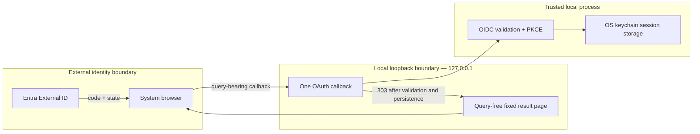

# Security Review — Loopback Callback Hardening

Related: [[features/spell-login/PRD|Spell login PRD]], [[features/spell-login/architecture|login architecture]]

**Reviewer:** Codex

**Date:** 2026-10-07

**Scope:** Query-free browser result routes, callback replay handling, response headers, and listener lifecycle in `src/modules/oidc.ts`.

## Trust Boundary and Data Flow

## OWASP Top 10 Results

| Category | Status | Evidence |
| --- | --- | --- |
| A01 Broken Access Control | PASS | The listener binds only to `127.0.0.1`; one callback is consumed and a replay receives HTTP 409. Product entitlement checks remain a separate future service concern. |
| A02 Cryptographic Failures | PASS | The provider connection uses HTTPS in production; OAuth uses PKCE, state and nonce. The local redirect uses loopback HTTP as required for a native public client. |
| A03 Injection | PASS | Result HTML and paths are fixed constants. OAuth query values are never interpolated into HTML, headers, logs or errors. |
| A04 Insecure Design | PASS | Validation and persistence finish before success is selected. The query-bearing callback redirects to a query-free route, and route/replay/lifecycle behavior has HTTP-level tests. |
| A05 Security Misconfiguration | PASS | Result pages send `no-store`, `no-referrer`, `nosniff`, and a CSP with `default-src 'none'`, blocked forms, framing and base URI. |
| A06 Vulnerable Components | PASS | `npm audit --omit=dev --audit-level=high` reported zero vulnerabilities on 2026-10-07. |
| A07 Authentication Failures | PASS | The OIDC library validates issuer, audience, expiry and nonce; the CLI validates refresh token and subject before storage and browser success. |
| A08 Software and Data Integrity Failures | PASS | No new deserialization or update channel was introduced. Fixed result states are selected from validated local outcomes. |
| A09 Security Logging Failures | PASS | Tokens, authorization codes and state remain absent from terminal and error output. The fixed result page contains no account data. |
| A10 SSRF | PASS | Provider endpoints come from the two compiled identity environments; callback and result traffic stays on the listener's random loopback port. |

## AI and Agent Security Results

| Risk | Status | Evidence |
| --- | --- | --- |
| Prompt injection | N/A | The callback does not process prompts or agent instructions. |
| Insecure output handling | PASS | External OAuth values are parsed by `openid-client` and are not used to build shell commands or HTML. |
| Excessive agency | N/A | The change adds no agent tools or permissions. |
| Secrets in context | PASS | Tests use synthetic credentials; the secrets scan passed and no live token or code is recorded. |
| Sensitive-data exposure via tools | PASS | The callback returns fixed pages and sends no telemetry. |
| Untrusted tools or MCP supply chain | N/A | No tool or MCP dependency changed. |

## Verification

- Full suite: 2,274 tests passed, 7 skipped, 0 failed.
- Coverage: 93.04% lines, 87.03% branches, 93.87% functions, 91.87% statements.
- Critical path `src/modules/oidc.ts`: 100% lines and functions, 97.05% branches, 99.13% statements.
- Build, lint, typecheck, secrets scan and production-dependency audit passed.
- Production smoke test: clean query-free success route, live identity verification, OS-keychain storage, logout, and signed-out confirmation passed on Windows on 2026-10-08.

## Findings

No critical, high, medium or low security findings remain in this change. The visual Gate assets are outside this review and stay blocked on the separate design selection and static-export review.

## Verdict

- [x] PASS — no critical or high findings.
- [ ] FAIL — remediation required before shipping.
