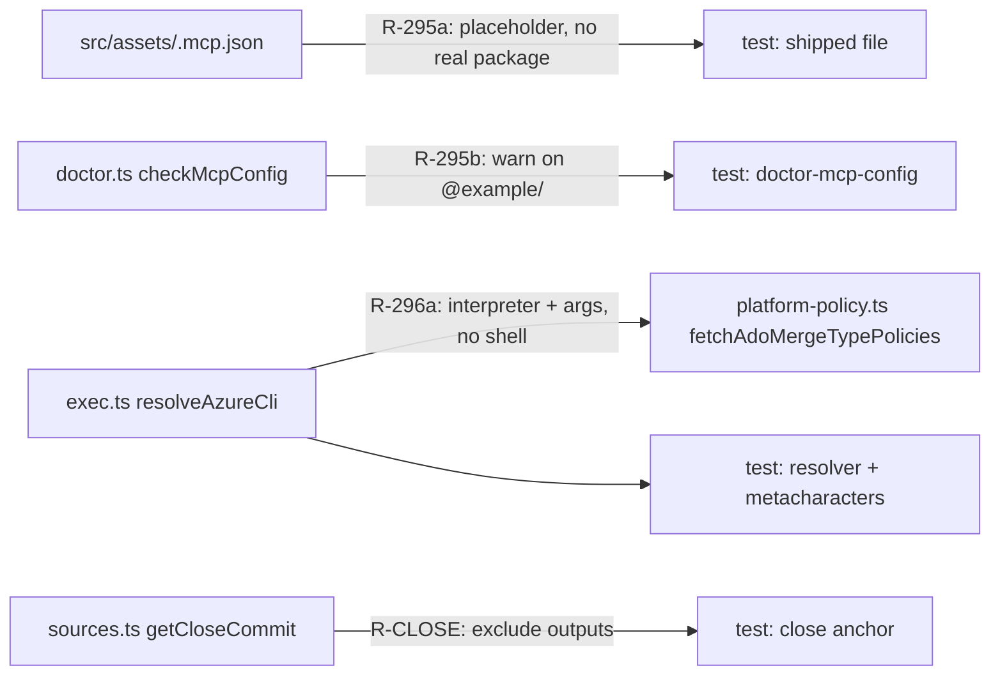

# Architecture — Epic 1: Safety fixes (upstream intake 2026-09-28)

Related: [PRD](../PRD.md), [execution plan](../execution-plan.md). Patch bump, one PR. This file
records the decisions the PRD left to the architect (Open Question 2) and the design of each story.
No database, no new command, no new flag, no new runtime dependency.

## Component map

## Decisions

**D1 — R-296a launches the Azure CLI's Python interpreter directly, never through `cmd.exe`.**
Measured on this machine (Windows 11, Node 24.14, Azure CLI 2.83, MSI install), not assumed:

| Mechanism | Result |
|---|---|
| `execFile("az.cmd")`, no shell | `EINVAL` (Node refuses `.cmd` without a shell): #296's cause, confirmed |
| `shell: true`, arguments joined | **side effect executed** (`a&echo PWNED>pwned.txt&b` wrote the file) |
| `cmd.exe /d /s /c` with quote-and-double-quote escaping | no injection in the payloads tried, but `100%PATH%` arrived as `100C:\Users\…`: the `%VAR%` text is **expanded into the argument** |
| `python.exe -IBm azure.cli <args>`, no shell | every payload (space, `&`, `\|`, `"`, `%VAR%`, `^`, `!`) arrived **unchanged**; a real `az --version` ran |

The installed launcher is one line: `"%~dp0\..\python.exe" -IBm azure.cli %*`. The `cmd.exe` route cannot
meet R-296a's acceptance criterion, because `%` cannot be neutralised on a `cmd.exe` command line, and
it would rest on cmd's quoting rules for text taken from a git remote. Rejected.

`resolveAzureCli()` (in `src/modules/exec.ts`) returns a launch plan `{ file, prefixArgs, env }`:

- **Not `win32`:** `{ file: "az", prefixArgs: [] }`. Byte-for-byte today's behaviour (R-296b).
- **`win32`:** scan `PATH` for `az.cmd`; read it; accept it only if it contains the recognised launcher
  line (`"%~dp0…\python.exe" -IBm azure.cli %*`); take `<dir of az.cmd>\..\python.exe`; require that file
  to exist; return `{ file: <that python.exe>, prefixArgs: ["-IBm", "azure.cli"], env: { AZ_INSTALLER: "MSI" } }`.
- **Anything else** (no `az.cmd`, an unrecognised launcher, no interpreter): `{ file: "az", prefixArgs: [] }`,
  today's launch by name. Operator decision after the review (originally `null`): it keeps an `az.exe`
  packaging working, and where `az` is not runnable the call fails and `spell doctor` prints the existing
  "could not query … is `az` installed" warning. **It never falls back to a shell.** Relative `PATH` entries are
  skipped, so a launcher in the working directory is never read. The resolver therefore never returns `null`.

`execFileWithTimeout` gains an optional fourth argument `{ env }` (merged over `process.env`). It still
never passes `shell`, so no caller can reintroduce shell interpretation by accident. `gh` calls are unchanged.

**Known limit, disclosed in the PR:** the resolver depends on the MSI installer's launcher layout. A
differently packaged Azure CLI on Windows gets today's plain `az` launch: it works if `az` is an executable,
and otherwise gets the same warning as today, not a wrong answer. That is deliberate.

**D2 — the AC's "stub `az.cmd`" becomes a stub interpreter.** The contract (arguments arrive unchanged,
no side effect from any metacharacter) is kept. The artefact changes, because the chosen mechanism never
executes `az.cmd`: the test injects a launch plan whose `file` is the current Node binary running an
echo script. That runs on every OS, and fails on Linux CI too if anyone adds `shell: true` (the payload's
`&echo x>marker&` would run and create the marker). A `win32`-only test additionally runs the real
resolved interpreter when Azure CLI is installed, and is skipped elsewhere.

**D3 — R-295a ships a placeholder that cannot be an npm package name.** The example server's package
argument becomes `<your-mcp-server-package>`. `<`, `>` and uppercase are invalid in npm package names, so
`npx -y "<your-mcp-server-package>"` exits 1 with `EINVALIDTAGNAME` (checked on this machine) instead of resolving to anyone's code. The test
reads the shipped file and fails on `@example/` and on any non-flag `args` entry that matches the npm
package-name grammar.

**D4 — R-295b detects by the `@example/` scope in a server's `args`.** It sits between "zero servers" and
the missing-timeout check in `checkMcpConfig`, returns `passed: false, blocking: false`, names the file and
the offending server keys, and states the fix. It never writes. The warning takes precedence over the
timeout warning because deleting or replacing the entry usually fixes both.

**D5 — R-CLOSE: exclude generated outputs on the `completedDate` branch. The author-date facet was measured and dropped.**

- `getCloseCommit`'s `completedDate` branch gets the same `:(exclude)` pathspec the no-`completedDate`
  branch has, so a report-only regeneration commit is never its own close. Shared helper `excludeOutputs`.
- **What this does and does not do, checked:** on a completed program it changes which commit is the close but
  no report output (`getCast` already ignores report-only commits; a report-only commit never moves the
  version). It does **not** fix PR #304's failure: `b43df06` regenerated the report *and* edited `TODO.md`, so
  it is not report-only. The PRD and TODO said it did; that was wrong and is corrected in `TODO.md`.
- **Author date was tried and rejected.** The plan was to walk on `%as` so a rebase (which rewrites the
  committer date) cannot move the close. Measured: `npm run check:report` failed, because commit `538a865`
  (authored 2026-09-28, landed 2026-09-29) then counts as inside `upstream-intake-2026-09` and moves its
  published cast from 55 to 56. The plan's own rule was "if any completed program's report drifts, reconsider",
  and the change would have republished a merged report. Committer date stays; the original comment's reason
  (it is the landing date and monotonic along the log) stands. The PR #305 cause remains INFERRED and the
  second facet stays open in `TODO.md`.
- Tests: a fail-first unit test on `getCloseCommit`; two guards that also pass on the old code (a trailered
  regeneration on the `completed:` day stays parity-clean; the close follows the landing date).

## Testing strategy

| Story | Test | Where |
|---|---|---|
| R-295a | shipped file has no `@example/`, no npm-valid non-flag arg, still has a `timeout` | `test/mcp-config-template.test.ts` (new) |
| R-295b | old line warns (non-blocking, names file + server), real server line passes, no `.mcp.json` passes silently | `test/doctor-mcp-config.test.ts` |
| R-296a | resolver on injected probes; hostile project/repo through `fetchAdoMergeTypePolicies` with a stub interpreter; `win32`-only live check | `test/azure-cli-launch.test.ts` (new) |
| R-296b | non-`win32` resolver returns `az` unchanged; `test/exec-timeout.test.ts` untouched | same file |
| R-CLOSE | (1) `getCloseCommit` skips a report-only commit on the `completed:` day (fail-first); (2) guard: a trailered regeneration keeps `check:report` green; (3) guard: the close follows the landing date | `test/show-report-close-anchor.test.ts` (new) |

Every new test is written to fail first against the pre-change code, and the failure is recorded in
`progress.txt`. Merge blocker: the metacharacter test (R-296a).
