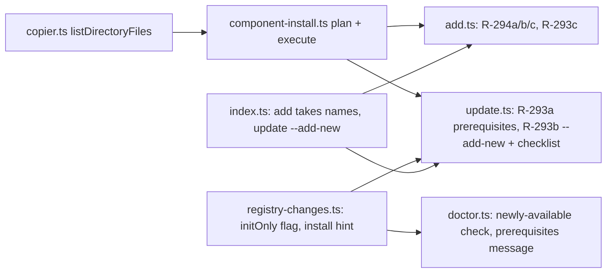

# Architecture — Epic 2: The install half of `spell update` (upstream intake 2026-09-28)

Related: [PRD](../PRD.md), [execution plan](../execution-plan.md),
[ARC-052](../../../DECISIONS.md#arc-052--spell-update-installs-the-requires-prerequisites-of-installed-components).
Minor bump, one PR. No new runtime dependency (`checkbox` comes from `@inquirer/prompts`, already used by
`src/modules/agents.ts`).

## Component map

## Decisions

**D1 — one plan-then-execute module for every install path (`src/modules/component-install.ts`).**
`spell add` and the two new `spell update` install paths must agree on what an existing destination means, and
#293 says its install path "reuses the `add` copy and refusal behaviour" #294 fixes. `planComponentInstall`
reads the disk and classifies every file the component ships (directories flattened through the new
`listDirectoryFiles`) as `missing`, `identical` or `differs` (line-ending-normalised hash, `hashFile`), then
splits them into `toCopy`, `kept` (existing, `skipExisting`) and `conflicts` (existing, not `skipExisting`).
`executeInstallPlan` writes `toCopy` only and returns the file list and hashes exactly as `add` records them
(ARC-038). Dry-run and the real run consume the same plan, which is what gives R-293a's "same list" criterion
and R-294a's three distinct lines a single source.

**D2 — `add` refuses before writing, never after.** Today `copyFile` throws on the first existing file, after
earlier files were already written, and the error is uncaught. The plan is computed first: any conflict without
`--force` prints one line (first file named, "and N more" when there are others, `--force` remedy) and exits 1
with nothing written (R-294b). `--force` overwrites, including a `skipExisting` file, matching `spell init`.

**D3 — a kept file is not recorded.** For a `skipExisting` component an existing destination is reported as kept
and left out of the manifest entry's `files` and `fileHashes`, as `spell init` and `spell update` already do
(`update.ts`: "recording one it merely declined to overwrite would claim ownership of an operator-authored
file, and `spell uninstall` deletes everything the manifest lists"). A component whose every file was kept is
still recorded, with no files.

**D4 — `spell add <names...>` is a sequential loop over the single-name handler.** Each name re-reads the
manifest, so progress survives a failure in the middle. An already-installed name is skipped with its existing
message, not an error. The first failure stops the loop: the error line, then `Added: …` and `Not attempted: …`
lines, exit 1. Dry-run walks every name and writes nothing.

**D5 — `update` installs prerequisites from a plan made before the component loop (R-293a, ARC-052).**
`findMissingRequires` already scopes to what the repository's profile includes. Each prerequisite is planned;
one that is `initOnly`, or has any destination already on disk, is **not installed** and stays in the
"Missing prerequisites" list with its `spell add` command and the reason. `update` never overwrites a file it
does not track. Planning before the loop means a dry run and a real run name the same set even when the loop
writes a file (ARC-052 decision 3). Repository scope only. A same-version run also installs them, so
"Already up to date" is only printed when nothing is missing, unmanaged or installable.

**D6 — newly available components: `--add-new`, or a checklist on a terminal (R-293b).** The candidates are
`findNewlyAvailable`'s list minus `initOnly` components. `--add-new` installs all of them; with a TTY and no
flag a `checkbox` (nothing pre-ticked) lets the operator choose; with neither, nothing is installed and the
list prints as today. `initOnly` components are never installed by `update`, with or without the flag,
following ARC-052 decision 2 and the PRD's Won't Have; they keep their `spell add` line. **This leaves a
known gap against the program-level criterion "an old install brought up with `--add-new` ends with the same
component set as a fresh `init`": it holds except for `initOnly` components (`docs-baseline`,
`line-ending-baseline`). Reported to the operator, not decided here.** A candidate with a conflicting
destination is skipped with a named reason, never overwritten, and does not stop the others.

**D7 — `--add-new` with `--user` is refused** with a clean message, like `--default-scope` without `--user`:
`spell add` has no `--user`, and the offer flow is a PRD Won't Have for the user tier.

**D8 — the report never contradicts the install.** After the installs, components installed in this run are
removed from the registry-changes lists (`missingRequires`, `newlyAvailable`) before they print, so a run
that installs `x` does not also say "x: not installed — nothing was added".

**D9 — `spell doctor` stays read-only.** The prerequisites check's message names `spell update` as the fix
(with `spell add` for the ones update will not install), and a new non-blocking "Newly available components"
check names `spell update --add-new` for installable ones and `spell add` for `initOnly` ones.

## Testing strategy

One test file per surface, temp-dir fixtures, real assets, no mocks of the filesystem:
`test/add.test.ts` (R-294a/b/c, R-293c), `test/component-install.test.ts` (plan classification),
`test/update-install.test.ts` (R-293a, R-293b matrix: interactive accept, decline, flag, no TTY without flag,
dry-run parity, `--user` refusal, hash recording, conflict skip), `test/doctor-*.test.ts` additions. Every
"nothing was written" and "same list" claim is asserted against the disk and the two outputs, with an
anti-vacuity count (`N compared, N > 0`).
