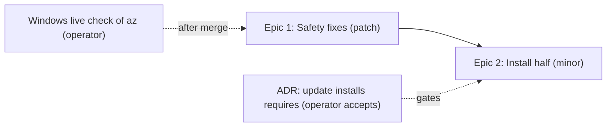

# Execution Plan: Upstream Intake Wave 2026-09-28

Related: [[development-methodology]] (the Spell Loop each epic runs), [[git-conventions]] (branch,
PR and merge rules).

Produced with `spell-scope` on 2026-09-29 from
[PRD.md](PRD.md). This is not a program: no `docs/plans/` entry, no delegation grant, no Show
Report. Two epics ship as two ordinary PRs through `spell-full-cycle`, and the operator merges
each one.

## PRD Summary

- **Source:** `features/upstream-intake-wave-2026-09-28/PRD.md`, from `TODO.md`'s "Upstream intake
  — 2026-09-28" section (#293–#296) plus one Show Report bug.
- **Target repo:** `codemagicianhq/arcane`, TypeScript CLI.
- **Classification:** Multi-cycle. About 13 stories, past the 8-story single-cycle line, with a
  clean seam between two file footprints.
- **Total epics:** 2
- **Total estimated stories:** 13
- **ADR candidates:** 1
- **Security flags:** 2

**Correction to the triage recorded in `TODO.md` on 2026-09-28.** That section proposed one code
wave, one PR, one minor bump and a single lane. Measured against source, the four issues split
along file footprints that do not overlap, and #295 is a supply-chain exposure that should not wait
behind an ADR decision that only #293 needs. The plan is therefore two PRs in series: a patch
release first, then a minor. The `TODO.md` intro is updated to match.

**Quality Quick-Check (spell-scope §1.5): skipped.** The scorecard in
`product-excellence-standards.md` grades product PRDs on UX, accessibility and competitive
dimensions. This is a CLI maintenance PRD with none of those surfaces, so grading it would be
noise.

## Dependency Graph

- **Critical path:** Epic 1, then Epic 2. Epic 2 also waits on the ADR.
- **Why serial:** each PR bumps `package.json` and every merged bump publishes. Two open PRs would
  collide on the version (ARC-028 R4).
- **Parallel work:** none between the epics. The ADR draft can be written while Epic 1 is in review.
- **Milestone gates (human):** merge of each PR, acceptance of the ADR before Epic 2 merges.

## Epics

### Epic 1: Safety fixes

- **Stories:** 5 (R-295a, R-295b, R-296a, R-296b, R-CLOSE)
- **Agent:** backend role
- **Dependencies:** none
- **Tracking item:** internal (`TODO.md`); closes #295 and #296
- **Risk:** Medium. R-296a is the risky part: it is a process spawn on Windows with text derived
  from a git remote.
- **Bump:** patch (a shipped asset changes, plus CLI bug fixes; no new command or flag)
- **Footprint:** `src/assets/.mcp.json`, `src/commands/doctor.ts` (MCP check only),
  `src/modules/exec.ts`, `src/modules/platform-policy.ts`,
  `src/modules/show-report/sources.ts`, their tests, `CHANGELOG.md`, `package.json`.
- **Notes:** R-CLOSE is the first story to drop if the epic runs long. `src/assets/.mcp.json` is a
  self-hosted asset, so `fix:self-host-parity` runs before the bump.

### Epic 2: The install half of `spell update`

- **Stories:** 8 (R-294a, R-294b, R-294c, R-293a, R-293b, R-293c, the ADR draft, docs)
- **Agent:** backend role, with architecture for the ADR
- **Dependencies:** Epic 1 merged, ADR accepted
- **Tracking item:** internal (`TODO.md`); closes #294 and #293
- **Risk:** Medium. It changes what `spell update` writes to a user's repository, so hash
  recording and dry-run parity are the failure modes.
- **Bump:** minor (`spell add` gains multiple names and `spell update` gains `--add-new`)
- **Footprint:** `src/commands/add.ts`, `src/commands/update.ts`, `src/commands/doctor.ts` (the
  prerequisites message), `src/index.ts`, `src/modules/copier.ts`, their tests, `DECISIONS.md`,
  `README.md`, `CHANGELOG.md`, `package.json`.
- **Notes:** #294 and #293 both edit `add.ts`, so they stay in one lane. Order inside the epic:
  #294 first, because #293's install path reuses the `add` copy and refusal behaviour it fixes.

## Architecture Decisions Required

#### ADR Candidate: `spell update` installs a component's `requires` prerequisites

**Trigger:** R-293a. It narrows the recorded position, in the `initOnly` comment in `update.ts`
(and D-09 of the prior program, for `.gitattributes` only; corrected 2026-09-29, this line first
said D-09 states it generally), that `update` does not add a component on its own.
**Options:**
1. Install `requires` only, never `initOnly`, never newly available components (the PRD's choice).
2. Stay report-only and rely on the existing doctor warning.
3. Install `requires` and newly available components together behind one flag.
**Recommendation:** option 1. A cited-but-missing governance document leaves a spell broken, while
a newly available component is a preference, which the flag in R-293b already covers.
**Blocking:** Epic 2. The number is allocated from the fetched trunk when the ADR is drafted
(ARC-051 is the latest today, on this branch and on trunk, so ARC-052 is the first free number).

## Security Flags

#### Security Flag: Windows shell interpretation of remote-derived text (R-296a)

**Threat:** `parseAdoRemote` accepts `&`, `|`, `"` and `%` in the project and repository segments
of a remote URL. Passing those through `shell: true` executes them in `cmd.exe`.
**Mitigation required:** launch `az.cmd` without shell interpretation of arguments, or escape every
argument for `cmd.exe` and prove it with the metacharacter test in R-296a. Do not ship
`shell: process.platform === "win32"` as the reporter suggested.
**Blocking:** yes. Epic 1 does not merge without the metacharacter test passing.

#### Security Flag: an unowned package name in a shipped file (#295)

**Threat:** a package name that returns 404 on npm can be claimed by anyone.
**Mitigation required:** R-295a removes it from the scaffold, and R-295b warns repositories that
already copied it. The warning is the only route to existing installs, because the file is
user-owned.
**Blocking:** no. It is the reason Epic 1 goes first.

## Agent Assignment

This repository has no roster. Roles resolve to generic workers.

| Role | Work |
|---|---|
| Architecture | The ADR draft and the R-296a mechanism choice |
| Backend | Both epics' implementation |
| QA | The metacharacter test, the dry-run and no-TTY matrices |
| DevOps | None. No workflow changes |

## Recommended Execution Order

1. Operator answers Open Question 1 (ADR direction) and says go on Epic 1. **Done 2026-09-29.**
2. Epic 1 through `spell-full-cycle`: architect, implement, `fix:self-host-parity`, one
   `spell-bump` (patch), `CHANGELOG.md`, review, one PR. **Operator merges.** **Done: [PR #308](https://github.com/codemagicianhq/arcane/pull/308), merged 2026-09-29, `1.9.1`.**
3. While Epic 1 is in review, draft the ADR as `Proposed`. **Operator accepts it.** **Drafted as ARC-052 (`Proposed`) on 2026-09-29 ([PR #312](https://github.com/codemagicianhq/arcane/pull/312)); accepted by the operator in chat the same day, Status set to `Accepted` in [PR #313](https://github.com/codemagicianhq/arcane/pull/313).**
4. Operator runs `spell doctor` on the Windows machine and confirms the branch-policy warning is
   gone. The stubbed test is the CI proof, not the live one. **Done 2026-09-29:** `spell doctor` 1.10.0 on this Windows machine in `arcane-ui` (remote `dev.azure.com/{ADO_ORG}/arcane/_git/arcane-ui`, Azure CLI 2.83.0 signed in) reports `✓ [pass] Platform branch/merge policy (T11)` with no "could not query" warning.
5. Epic 2 through `spell-full-cycle`, one `spell-bump` (minor), one PR. **Operator merges.** **Done: [PR #313](https://github.com/codemagicianhq/arcane/pull/313), merged 2026-09-30T01:23Z, `1.10.0` on npm; #293 closed by the merge, #294 closed by hand the same day (the PR body's "Closes #293 and #294" only closed the first).**
6. Tick the four intake items in `TODO.md` with PR and version, close #293–#296 if the PR text did
   not, and run `spell-close-session`. **Done 2026-09-29: #293 and #294 ticked in `TODO.md` (#295 and #296 were ticked with Epic 1). Only step 4, the operator's live Windows check, stays open.**

## Open Questions

1. Approve the ADR direction (option 1 above)? It gates Epic 2. **Answered 2026-09-29: yes, option 1; ARC-052 is `Accepted`.**
2. R-296a mechanism: argument escaping through `cmd.exe`, or the Azure CLI's own entry point. The
   architect can decide without the operator, unless the choice needs a new runtime dependency.
3. Should R-CLOSE ride in Epic 1 or wait for a Show Report wave? Recommended: ride in Epic 1, one
   small change in a file no other story touches.
