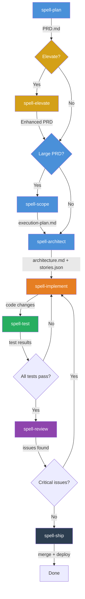

# Development Methodology — The Spell Loop

A structured development methodology combining progressive context phases and an autonomous implementation loop, delivered through the Arcane spell system. Designed for multi-agent infrastructure.

## Executive Summary

- The Spell Loop is the standard development methodology for all projects that adopt it.
- It combines two proven patterns: the autonomous implementation loop and the spell system (operational workflows), with structured planning phases.
- Work flows through phases: Plan → [Elevate] → [Assess] → Architect → [Implement → Test → Review]\* → Ship.
- Optional elevation phase uses Vision (research) and Wanda (marketing) to proactively enhance PRD quality.
- The implementation phase is an autonomous loop — agents iterate until all stories pass quality gates.

---

## The Spell Loop Flow



### Phase Overview

| Phase              | Spell             | Agent Owner                           | Input                                       | Output                                                                                                 |
| ------------------ | ----------------- | ------------------------------------- | ------------------------------------------- | ------------------------------------------------------------------------------------------------------ |
| **Planning**       | `spell-plan`      | Vision (research) + Primus (product)  | Feature description or TODO item            | `PRD.md` — requirements, acceptance criteria, constraints                                              |
| **Elevation**      | `spell-elevate`   | Vision (research) + Wanda (marketing) | PRD.md                                      | Enhanced PRD — proactive quality improvements, competitive analysis, UX/a11y/perf/security gaps filled |
| **Assessment**     | `spell-scope`     | Gandalf + Vision + Snape              | Large PRD                                   | `execution-plan.md` — epics, dependency graph, ADR candidates, security flags, agent assignments       |
| **Solutioning**    | `spell-architect` | Gandalf (architecture)                | PRD.md (or single epic from execution plan) | `architecture.md` + `stories.json` — tech decisions, epic/story breakdown                              |
| **Implementation** | `spell-implement` | Thor / Flash / Wasp (build team)      | stories.json                                | Working code, committed per story                                                                      |
| **Quality**        | `spell-test`      | Snape (QA) + dev agent                | Code changes                                | Test results, coverage report, evidence                                                                |
| **Quality**        | `spell-review`    | Snape (QA) or Gandalf (arch)          | Code diff                                   | Adversarial review findings                                                                            |
| **Delivery**       | `spell-ship`      | Human (approval) + Scotty (infra)     | Passing code + reviews                      | Merged PR, deployed artifact                                                                           |

---

## Key Concepts

### Work Tracking Modes

Arcane supports two work-tracking modes selected early (during `spell-open-session` or `spell-plan`):

- **`tracking_mode: internal`** — source of truth is repository artifacts (`PRD.md`, `execution-plan.md`, `stories.json`, `TODO.md`), with no external tracker dependency.
- **`tracking_mode: external`** — source of truth is still repository artifacts, but selected milestones/work items are mirrored to an external tracker.

For backward compatibility with existing Azure DevOps workflows, if tracking mode is not explicitly set and an ADO context is already present (work item ID, org, and project), default to:

```yaml
tracking_mode: external
external_provider: ado
```

Persist tracking configuration in PRD frontmatter (and in `.arcane.json` when available) so downstream spells do not lose context:

```yaml
tracking:
  tracking_mode: external # internal | external
  external_provider: ado  # ado | jira | other
  ado:
    org: "{ADO_ORG}"
    project: "{ADO_PROJECT}"
    process_template: "Agile"
```

### Process-Template-Aware ADO Hierarchy Rules

When `tracking_mode=external` and `external_provider=ado`, do not hardcode work item types. Resolve types from the project's process template and currently enabled types first:

```bash
az devops project show \
  --org https://dev.azure.com/{org} \
  --project {project} \
  --query "capabilities.processTemplate.templateName" \
  --output tsv

az boards work-item-type list \
  --org https://dev.azure.com/{org} \
  --project {project} \
  --output json \
  --query "[].name"
```

Use this fallback order against the discovered type list (baseline observed options: `Bug`, `Epic`, `Feature`, `Issue`, `Task`, `Test Case`, `User Story`):

| Logical level | Preferred type order |
| --- | --- |
| Epic-level | Epic → Feature → User Story → Issue |
| Feature-level | Feature → User Story → Issue |
| Story-level | User Story → Issue → Task |
| Task-level | Task → Issue |
| Defect-level | Bug → Issue → Task |

Child linkage rules:

1. Preserve logical hierarchy order (Epic-level parent of Feature-level, Feature-level parent of Story-level, Story-level parent of Task/Bug-level).
2. Attempt native ADO parent/child hierarchy links first.
3. If the selected fallback type combination cannot be linked as parent/child in that process template, use `Related` links and prefix titles with logical level tags (for example: `[EPIC]`, `[FEATURE]`) to preserve intent.
4. Never silently flatten hierarchy. Document fallback/link decisions in `execution-plan.md` notes.

### External Provider TODOs

- **Jira (`external_provider=jira`)** — TODO: define issue-type mapping, parent-child/epic linkage strategy, and command examples.
- **Other providers (`external_provider=other`)** — TODO: define required metadata contract and fallback behavior before enabling automation.

### Fresh Context Per Iteration

Each implementation iteration starts with clean context. The only memory between iterations is:

- **`stories.json`** — which stories are done (`passes: true/false`)
- **`progress.txt`** — append-only learnings from previous iterations
- **Git history** — commits from previous iterations

This prevents context poisoning — where an agent's failed approach poisons subsequent attempts.

### Progressive Context Chain

Each phase produces artifacts that inform the next phase:

```
Feature idea
  → PRD.md (requirements, acceptance criteria)
    → architecture.md (tech decisions, ADRs)
      → stories.json (implementable work units)
        → code (guided by architecture + story context)
          → test results (validates requirements)
            → review findings (validates architecture compliance)
```

Without this chain, agents make conflicting decisions across stories (e.g., one uses REST, another uses GraphQL).

### Adversarial Review

`spell-review` requires the reviewer to **find issues**. "Looks good" is not an acceptable review. The reviewer must:

1. Find a minimum of 3 issues (or explain why fewer exist)
2. Classify each as HIGH / MEDIUM / LOW severity
3. Check for missing test coverage, architecture violations, security issues
4. Defer unrelated findings to a backlog (don't derail the current change)

### Append-Only Progress

`progress.txt` is never edited, only appended. Each iteration adds:

```
## Iteration N — [story-id] — [timestamp]
### What was done
- [summary of changes]
### What was learned
- [patterns discovered, gotchas, conventions]
### What to watch for
- [warnings for future iterations]
```

---

## Story Format (stories.json)

The Arcane story schema for autonomous implementation:

```json
{
  "feature": "Feature Name",
  "branchName": "thor/feat/feature-name",
  "assignedAgent": "thor",
  "trackingMode": "external",
  "externalProvider": "ado",
  "adoWorkItemId": 541,
  "userStories": [
    {
      "id": "STORY-001",
      "title": "Short description",
      "description": "Detailed requirements",
      "acceptanceCriteria": ["Criterion 1", "Criterion 2"],
      "priority": 1,
      "passes": false,
      "assignedTo": "thor",
      "testEvidence": null
    }
  ]
}
```

### Schema Validation

`spell-architect` must output stories.json using **exactly** this schema — all required fields must be present. Missing fields break `spell-implement`'s autonomous loop. Gandalf must validate before outputting:

- `feature`, `branchName`, `assignedAgent`, `trackingMode` — top-level required
- `externalProvider` — required when `trackingMode=external`; optional otherwise
- `adoWorkItemId` — required only when `trackingMode=external` and `externalProvider=ado`
- Per story: `id`, `title`, `description`, `acceptanceCriteria`, `priority`, `passes: false`, `assignedTo`, `testEvidence: null`

If the output is missing required tracking fields, `passes`, `assignedTo`, `priority`, or `testEvidence`, it is malformed and must be regenerated.

### Story Sizing

Each story must be small enough to complete in one context window:

**Right-sized:**

- Add a database column and migration
- Add a UI component to an existing page
- Implement a single API endpoint
- Add a filter dropdown to a list

**Too big (split these):**

- "Build the entire dashboard"
- "Add authentication"
- "Refactor the API layer"

---

## Full Cycle (Autonomous Pipeline)

For features that should run end-to-end with minimal human intervention, use `spell-full-cycle`:

```
spell-full-cycle = spell-plan → [spell-elevate] → spell-architect → [spell-implement → spell-test → spell-review]* → spell-ship
```

The entire pipeline runs autonomously with a single human gate at PR approval. Includes optional PRD elevation between Plan and Architect (runs automatically if any quality dimension scores Bronze, or if `--elevate` is specified). Requires three inputs: feature description, tracking configuration (`tracking_mode` and optional `external_provider`), and target repo. In ADO mode, include the ADO work item ID. Each phase has built-in quality gates that halt the pipeline on failure rather than producing garbage for downstream phases.

See [.github/prompts/spell-full-cycle.prompt.md](../.github/prompts/spell-full-cycle.prompt.md) for the complete prompt.

---

## Assessment Flow (Large PRDs)

For PRDs too large for a single Spell Loop cycle, insert `spell-scope` between planning (and optional elevation) and solutioning:

```
spell-plan → [spell-elevate] → spell-scope → [spell-architect → spell-implement → spell-test → spell-review → spell-ship]* per epic
```

`spell-scope` reads the full PRD and produces an `execution-plan.md` containing:

- **Epic splitting** — self-contained, sprint-sized work packages with dependency ordering
- **Architecture decision candidates** — new ADRs needed before implementation
- **Security flags** — threat model impact and required mitigations
- **Agent assignments** — which agents handle each epic
- **Dependency graph** — Mermaid diagram of execution order and parallelization opportunities

Each epic then runs through its own Spell Loop cycle (architect → implement → test → review → ship).

Before starting the next epic after a major output checkpoint (execution plan, architecture + stories, full test evidence, or ship recommendation), run `spell-commit-work` to preserve progress and checkpoint branch state.

See [.github/prompts/spell-scope.prompt.md](../.github/prompts/spell-scope.prompt.md) for the complete prompt.

---

## Quick Flow (Small Changes)

For bug fixes, small refactors, or single-file changes, skip Planning and Solutioning:

```
spell-implement → spell-test → spell-review → spell-ship
```

No PRD or architecture doc needed. The developer provides the intent directly to `spell-implement`.

---

## Interactive Tool Builds (Copilot / Claude in VS Code)

When GitHub Copilot, Claude in VS Code, or any other interactive AI tool (not an autonomous agent-runtime agent) is used to write code, the **same quality gates apply** as for autonomous agent builds. Interactive tools are implementation executors — they occupy the same position in the Spell Loop as `spell-implement`.

### Rule: Interactive tools cannot self-validate

A tool that writes code **must not** also run `spell-review` on that same code. This is the same constraint that prevents Thor from marking his own stories as passing. Specifically:

- Copilot sessions count as implementation (`spell-implement` equivalent)
- `spell-test` must be run to produce test evidence before review
- `spell-review` must be run by a different agent or in a separate session with adversarial intent
- "Looks good to me" within the same Copilot chat that wrote the code is **not** a spell-review

### Minimum gate for any Copilot-produced code

```
Copilot implements → spell-test (run tests, check coverage) → spell-review (adversarial pass, min 3 findings) → spell-ship
```

This applies regardless of change size. Even single-file bug fixes must pass `spell-review` before being pushed to `origin/main`.

### Why this rule exists

A tool that both writes and validates its own work cannot be trusted to catch its own mistakes. In practice, when an interactive tool builds a codebase and also self-validates, defects slip through — for example, a roster of fabricated agents that never existed in `agent-policies.md`, or invented APIs that were never defined. A separate adversarial `spell-review` pass reliably catches these. The defects would ship if the gate were skipped.

---

## Agent Roster and Roles

| Role            | Agent               | Notes                                              |
| --------------- | ------------------- | -------------------------------------------------- |
| Product Manager | Primus + Vision     | Primus owns product; Vision provides research      |
| Architect       | Gandalf             | CTO / Architecture Lead                            |
| Developer       | Thor / Flash / Wasp | Build team handles implementation                  |
| QA Lead         | Snape               | QA Lead validates test evidence                    |
| Scrum Master    | Primus              | Product Operations Manager handles sprint tracking |
| UX / Frontend   | Wasp                | Frontend developer handles UX when needed          |
| Tech Writer     | Any agent           | No dedicated tech writer; any agent can document   |

---

## Spell Reference

### Development Loop Spells

| Spell             | Invocation         | Purpose                                                      |
| ----------------- | ------------------ | ------------------------------------------------------------ | --- | ----------------- | ------------------ | ----------------------------------------------------------------------------- |
| `spell-plan`      | `@spell-plan`      | Generate PRD from feature description                        |     | `spell-elevate`   | `@spell-elevate`   | Elevate PRD quality — competitive research, UX/a11y/perf/security enhancement |
| `spell-scope`     | `@spell-scope`     | Scope and split large PRDs into epics with execution plan    |     | `spell-architect` | `@spell-architect` | Architecture decisions + story breakdown                                      |
| `spell-implement` | `@spell-implement` | Autonomous loop: pick story → build → test → commit → repeat |
| `spell-test`      | `@spell-test`      | Run tests, validate coverage, generate evidence              |
| `spell-review`    | `@spell-review`    | Adversarial code review                                      |
| `spell-ship`      | `@spell-ship`      | Pre-deploy checklist, merge approval                         |

### Specialist Spells

| Spell                   | Invocation               | Purpose                                    |
| ----------------------- | ------------------------ | ------------------------------------------ |
| `spell-dotnet-expert`   | `@spell-dotnet-expert`   | Load .NET best practices for any dev agent |
| `spell-security-review` | `@spell-security-review` | OWASP Top 10 + dependency audit            |
| `spell-product-review`  | `@spell-product-review`  | Build/Measure/Analyze/Decide cycle         |

### Existing Operational Spells

| Spell                      | Purpose                                      |
| -------------------------- | -------------------------------------------- |
| `spell-open-session`       | Rebuild context at session start             |
| `spell-close-session`      | Journal, summarize, update TODO              |
| `spell-commit-work`        | Conventional Commits with trailers           |
| `spell-check-drift`        | Documentation audit for staleness            |
| `spell-bootstrap-business` | Scaffold new business docs                   |
| `spell-explain-concept`    | Bridge concepts to project context           |
| `spell-todo`               | Manage TODO.md lifecycle                     |
| `spell-generate-bot-icons` | Generate agent avatar assets                 |
| `spell-bug`                | Bug lifecycle: document → tracker/TODO → fix → verify |
| `spell-suggest-feature`    | Feature capture: user story → tracker/TODO → backlog  |

---

## Open-Source Strategy

The Spell Loop is a candidate for open-source release as a productized automation offering. Key differentiators:

1. **Multi-agent orchestration** — not just one AI tool, but a team of specialized agents
2. **Power-level governance** — agents have scoped autonomy per repo
3. **Git attribution** — every commit traces back to the agent that produced it
4. **Progressive context chain** — structured planning phases feed each successive phase with richer context
5. **Spell prompt packaging** — portable `.prompt.md` files that work across AI IDEs
