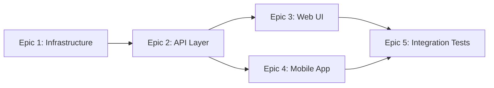

## Executive Summary

- This spell takes a PRD of any size and produces an actionable execution plan.
- It assesses scope, splits into sprint-sized epics, identifies architecture/security decisions needed, and maps agents to work.
- Use this before `spell-architect` when the PRD is too large for a single Spell Loop cycle. (Formerly `spell-assess`.)
- Output: `execution-plan.md` — ordered epics with dependency graph, risk flags, ADR candidates, and agent assignments.

---

Analyze the provided PRD and produce a scoped execution plan.

Use these files for context. Each is optional — if a file is missing, proceed with the stated fallback and note the gap in the output's Open Questions:

- [governance/development-methodology.md](../../governance/development-methodology.md) — Spell Loop methodology, story sizing rules, and the canonical **ADO Hierarchy Rules**. *Fallback: if missing, use the default sizing of 4–8 right-sized stories per cycle described below and skip external-tracker hierarchy mapping.*
- [governance/testing-standards.md](../../governance/testing-standards.md) — Testing frameworks per stack. *Fallback: if missing, flag test strategy as an open question.*
- [governance/cicd-standards.md](../../governance/cicd-standards.md) — Pipeline requirements. *Fallback: if missing, omit pipeline considerations.*
- [DECISIONS.md](../../DECISIONS.md) — Existing ADRs to check against. *Fallback: if missing, treat all architecture decisions as new candidates.*
- [security/threat-model.md](../../security/threat-model.md) — Active threat model. *Fallback: if missing, apply OWASP Top 10 as the baseline.*
- [agents/agent-policies.md](../../agents/agent-policies.md) — Agent roster, power levels, capabilities. *Fallback: if missing, assign work by role label (architecture, backend, frontend, mobile, QA, DevOps, research) instead of named personas.*
- [naming-conventions.md](../../naming-conventions.md) — Agent roster and role-to-persona mapping. *Fallback: if missing, refer to roles by their generic label.*
- [project.md](../../project.md) — Project goals and business context. *Fallback: if missing, derive context from the PRD itself.*
- [governance/product-excellence-standards.md](../../governance/product-excellence-standards.md) — PRD Quality Scorecard and scoring rubric. *Fallback: if missing, skip the Quality Quick-Check (section 1.5) and note that it was skipped.*

> **Roster by reference.** This spell maps work to **roles** (architecture, backend, frontend, mobile, QA, DevOps, research, marketing). Resolve each role to a concrete agent persona via `agents/agent-policies.md` / `naming-conventions.md` at run time — do not assume a fixed set of persona names.

> **Placeholder resolution.** `{ADO_ORG}`, `{ADO_PROJECT}`, `{BUSINESS_NAME}`, and any other `{UPPER_SNAKE}` token resolve from `.arcane.json` or the PRD frontmatter; if a value is unset, ask rather than assuming a default.

---

## Workflow

### 1. PRD Intake

Accept the PRD from one of these input sources:

| Source | Format | How to fetch |
|--------|--------|--------------|
| **File path** | `PRD.md` or any markdown file | Read the file directly |
| **Pasted content** | Inline text in the prompt | Use as-is |
| **External tracker work item ID** (external mode) | `#507` or `507` with org name | Detect the provider (see tracking settings below) and fetch the item's title, description, and acceptance criteria via that provider's CLI/API. For ADO: `az boards work-item show --id {id} --org https://dev.azure.com/{ADO_ORG} --output json` and extract `System.Description`, `Microsoft.VSTS.Common.AcceptanceCriteria`, and `System.Title` |

If the input is an external work item ID:
1. Confirm the org/account: `{ADO_ORG}` — resolve from `.arcane.json` / PRD frontmatter; ask if unset.
2. Fetch the item via the detected provider (for ADO: `az boards work-item show`).
3. If the work item has child items, fetch those too — they may contain additional requirements.
4. Combine all content into a single PRD view before proceeding.

Resolve tracking settings from PRD frontmatter (preferred) or ask:
- `tracking_mode: internal | external`
- `external_provider: ado | jira | other`

If unset and ADO context already exists, default to `external` + `ado` for backward compatibility.

If `tracking_mode=external` and `external_provider=ado`, resolve template/type availability before splitting epics (resolve `{ADO_ORG}` / `{ADO_PROJECT}` from `.arcane.json` / PRD frontmatter; ask if unset):
```bash
az devops project show --org https://dev.azure.com/{ADO_ORG} --project {ADO_PROJECT} --query "capabilities.processTemplate.templateName" --output tsv
az boards work-item-type list --org https://dev.azure.com/{ADO_ORG} --project {ADO_PROJECT} --output json --query "[].name"
```
For non-ADO providers, detect the provider from `external_provider` and resolve its equivalent item types instead.

Read the full PRD. Extract:
- **Feature name** and business context
- **Target repo** and tech stack
- **Total requirement count** (Must Have / Should Have / Won't Have)
- **Total acceptance criteria count**
- **Dependencies** on external services, APIs, or decisions

### 1.5. Quality Quick-Check

Before proceeding to scope assessment, run a quick quality audit against the PRD Quality Scorecard in `governance/product-excellence-standards.md`. Score each dimension (Requirements, UX, Accessibility, Performance, Security, Responsive, Competitive) as Bronze / Silver / Gold.

If any dimension scores **Bronze**, recommend:
> 💡 **Quality recommendation:** This PRD scores Bronze on [dimensions]. Consider running `spell-elevate` to enhance the PRD before continuing with assessment and architecture. `spell-elevate` will conduct competitive research (research role) and marketing review (marketing role), and proactively add missing quality requirements.

This is a recommendation, not a gate — the user decides whether to elevate first or proceed directly. Include the scorecard results in the execution plan output regardless.

### 2. Scope Assessment

Evaluate the PRD against Spell Loop sizing rules:
- Each Spell Loop cycle = **1-2 weeks of agent work** = **4-8 right-sized stories**
- A right-sized story: one file change, one endpoint, one component, one migration
- Flag anything that violates story sizing: "Build the entire dashboard", "Add authentication", "Refactor the API layer"

Classify the PRD:

| Classification | Criteria | Action |
|---------------|----------|--------|
| **Single cycle** | ≤ 8 stories, no cross-cutting concerns | Proceed directly to `spell-architect` |
| **Multi-cycle** | 9-30 stories, clear epic boundaries | Split into epics, each gets its own Spell Loop run |
| **Program-scale** | 30+ stories, multiple subsystems, cross-team concerns | Split into phases with milestone gates between them |

### 3. Epic Splitting (if multi-cycle or program-scale)

Break the PRD into epics. Each epic must be:
- **Self-contained** — shippable independently (no half-built features)
- **Sprint-sized** — 4-8 stories per epic
- **Dependency-ordered** — infrastructure before API before UI before polish

For each epic, define:
```markdown
### Epic N: [Name]
**Stories (estimated):** [count]
**Dependencies:** [prior epics or external]
**Tech stack:** [frameworks, platforms]
**Primary role:** [backend / frontend / mobile / full-stack — resolve to a persona via `agent-policies` / `naming-conventions`]
**Risk level:** Low / Medium / High
**Sprint estimate:** [1 or 2 cycles]
```

### 3.5. External Tracker Mapping (external mode)

Only applies when `tracking_mode=external`. Skip entirely for internal mode.

Do **not** inline the work-item-type fallback order or the parent/child linkage rules here — they are the single source of truth in [governance/development-methodology.md](../../governance/development-methodology.md) → **Process-Template-Aware ADO Hierarchy Rules**. Detect the provider from `external_provider`, then apply those rules. *Fallback: if that doc is missing, record the tracker mapping as an Open Question and proceed without item-type assignment.*

Scope-specific delta (the only thing this spell adds on top of those rules): each split **epic** maps to the **Epic-level** logical level — use the `Epic` work item type whenever the resolved provider/template offers it, and record the selected type per epic in `execution-plan.md`. All lower-level and linkage decisions defer to the governance rules above.

### 4. Architecture Decision Check

Scan the PRD for decisions that need ADRs:
- New frameworks or libraries not already in the stack
- New external service integrations (APIs, databases, auth providers)
- Data model changes that affect multiple subsystems
- Deployment topology changes
- New communication patterns (sync vs async, REST vs gRPC vs events)

For each candidate:
```markdown
#### ADR Candidate: [Title]
**Trigger:** [What in the PRD requires this decision]
**Options:** [2-3 alternatives]
**Recommendation:** [If obvious, state it; otherwise flag for the architecture role]
**Blocking:** [Which epics are blocked until this is decided]
```

### 5. Security Review

Check the PRD against the threat model:
- Does this feature introduce new attack surface? (new endpoints, new auth flows, new data stores)
- Does it handle PII, payment data, or secrets?
- Does it change trust boundaries? (new external integrations, new user roles)
- Are there OWASP Top 10 concerns? (injection points, auth gaps, data exposure)

For each concern:
```markdown
#### Security Flag: [Title]
**Threat:** [What could go wrong]
**Mitigation required:** [What the implementation must include]
**Blocking:** [yes/no — can the epic proceed without resolving this?]
```

### 6. Agent Assignment

Map each epic to the right **role**, then resolve each role to a concrete agent persona via `agents/agent-policies.md` / `naming-conventions.md` (fallback: keep the generic role label if the roster files are absent):

| Role | When |
|------|------|
| Architecture | ADR candidates, cross-epic design decisions |
| Backend / Full-stack | APIs, databases, server-side logic |
| Frontend / UI | Web UI, component frameworks |
| Mobile | Native/cross-platform mobile apps |
| QA | Test strategy, coverage validation |
| DevOps | Pipeline creation, deployment config |
| Research | Unknowns, technology evaluation, competitive analysis |
| Marketing | User-facing copy, landing pages, SEO |

Flag any epics that need **multiple roles** (e.g., a full-stack feature = backend + frontend + QA).

### 7. Dependency Graph

Produce a Mermaid diagram showing epic execution order:



Identify:
- **Critical path** — the longest dependency chain
- **Parallelizable epics** — epics that can run simultaneously on different branches
- **Milestone gates** — points where human review is needed before continuing

### 8. Execution Plan Output

Produce `execution-plan.md` with this structure:

```markdown
# Execution Plan: [Feature Name]

## PRD Summary
- **Source:** [PRD file or inline]
- **Business:** [which business]
- **Target repo:** [org/repo]
- **Classification:** Single cycle / Multi-cycle / Program-scale
- **Total epics:** [N]
- **Total estimated stories:** [N]
- **ADR candidates:** [N]
- **Security flags:** [N]

## Dependency Graph
[Mermaid diagram]

## Epics

### Epic 1: [Name]
- **Stories:** [estimated count]
- **Agent:** [primary]
- **Dependencies:** none
- **Tracking item:** [internal-only OR external provider + type/id]
- **Risk:** Low/Medium/High
- **Notes:** [any special considerations]

### Epic 2: [Name]
...

## Architecture Decisions Required
[List of ADR candidates with recommendations]

## Security Flags
[List of security concerns with mitigations]

## Recommended Execution Order
1. Resolve ADR candidates (architecture role)
2. Epic 1 — spell-full-cycle or spell-architect → spell-implement → spell-ship
3. Run spell-commit-work to checkpoint major outputs before starting Epic 2
4. Epic 2 — ...
5. [milestone gate if needed]
6. Epic N — ...

## Open Questions
[Anything that needs human decision before execution can start]
```

If `external_provider=jira` or `external_provider=other`, add explicit TODOs in Open Questions for provider-specific type mapping and linkage automation.

### 9. Present and Confirm

Present the execution plan to the user. Ask:
1. Does the epic split make sense?
2. Are the ADR candidates correct? Should any be decided now?
3. Are there epics that should be deprioritized or cut?
4. Ready to start with Epic 1?

---

## Rules

- **Never start implementation from this spell.** This spell produces a plan, not code. The output feeds into `spell-architect` or `spell-full-cycle`.
- **Be honest about unknowns.** If the PRD references technology or services you don't have context on, flag it as a research item for the research role.
- **Respect existing ADRs.** If the PRD proposes something that contradicts an existing ADR, flag the conflict — don't silently override.
- **Conservative estimates.** When in doubt, split smaller. Two small epics are better than one that's too big.
- **Security is non-negotiable.** If a security flag is blocking, it blocks. No "we'll add auth later."
